<div align="center">


# Traefik Manager

**A clean, self-hosted web UI for managing your Traefik reverse proxy.**

Add routes, manage middlewares, monitor services, and view TLS certificates - all without touching a YAML file by hand.

[](https://github.com/chr0nzz/traefik-manager/pkgs/container/traefik-manager)
[](LICENSE)
[](https://github.com/chr0nzz/traefik-manager/releases)

</div>
<div align="center">
<sub>Built for homelabbers who love Traefik but hate editing YAML at 2am.</sub>
</div>

---

## Interface Gallery

Explore the Traefik Manager interface and workflows. Click on a category below to expand the screenshots.

<details>
<summary><b>Initial Setup Workflow</b></summary>
<p align="center">
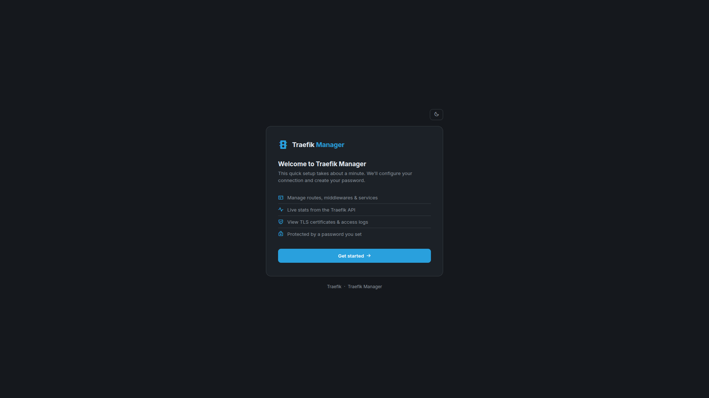
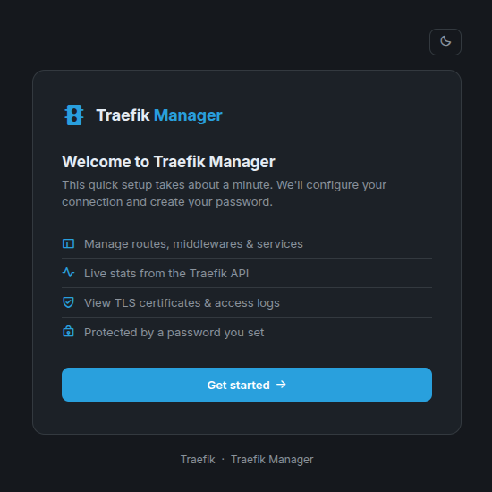
<br />
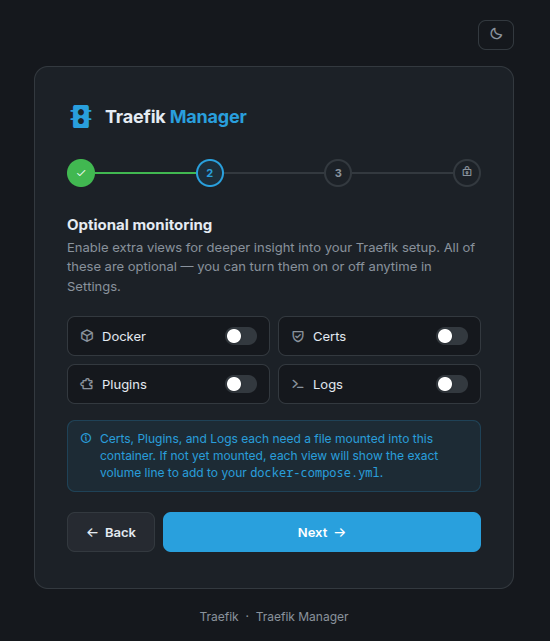

</p>
<p align="center"><i>A guided 4-step process to get your Traefik instance connected and configured.</i></p>
</details>

<details>
<summary><b>Routes & Traffic Management</b></summary>
<table>
<tr>
<td width="33%">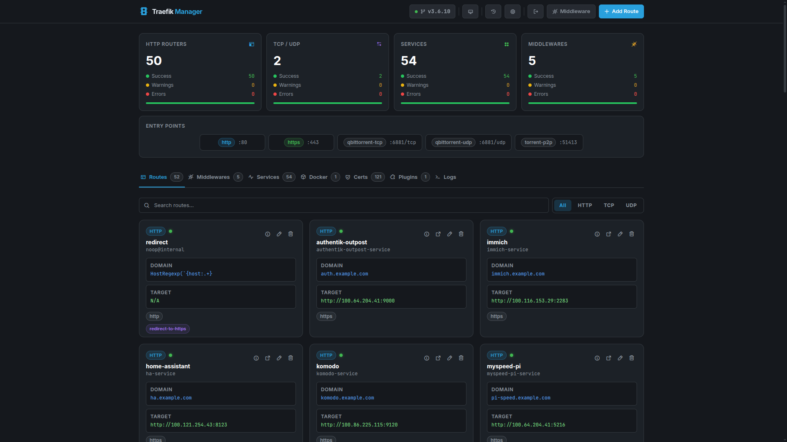<br /><b>Routes Overview</b>: Global view of entrypoints and rules.</td>
<td width="33%">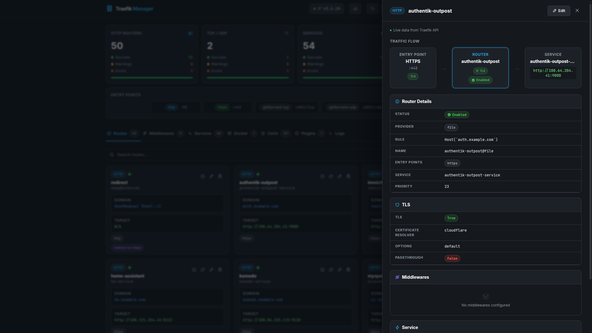<br /><b>Route Details</b>: Deep dive into specific rule logic.</td>
<td width="33%">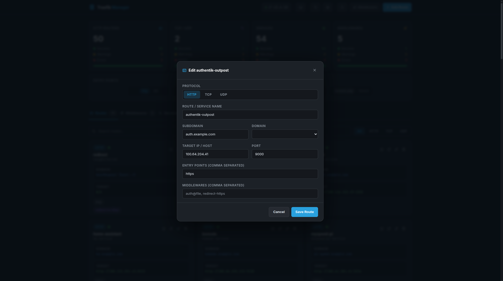<br /><b>Edit Mode</b>: Real-time updates to your routing table.</td>
</tr>
</table>
</details>

<details>
<summary><b>Services</b></summary>
<p align="center">
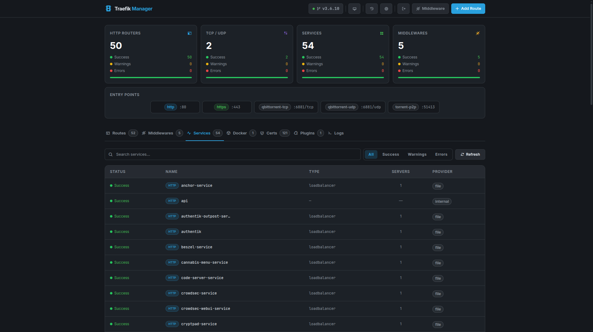
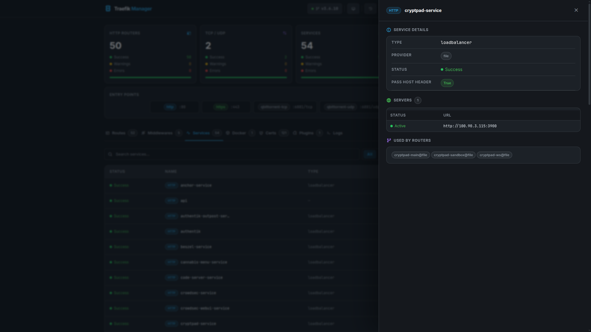
</p>
<p align="center">Monitor backend health and target status for all registered services.</p>
</details>

<details>
<summary><b>Middlewares</b></summary>
<table>
<tr>
<td>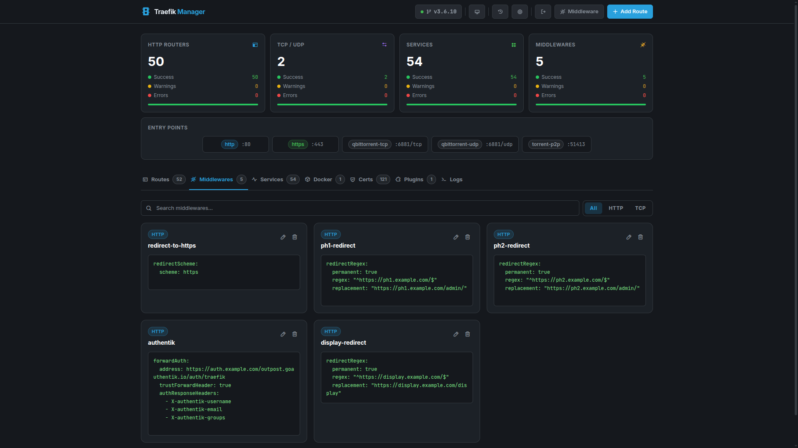<br /><b>List View</b>: Overview of active middleware.</td>
<td>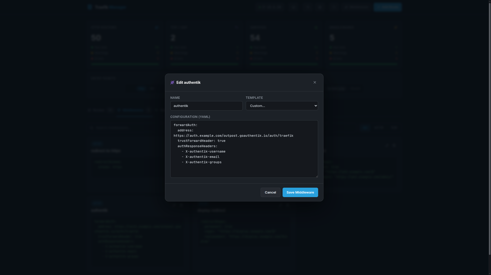<br /><b>Editing</b>: Fine-tune headers and auth.</td>
<td><br /><b>Add New</b>: Quick middleware creation.</td>
</tr>
</table>
</details>

<details>
<summary><b>Plugins & Certificates</b></summary>
<p align="center">
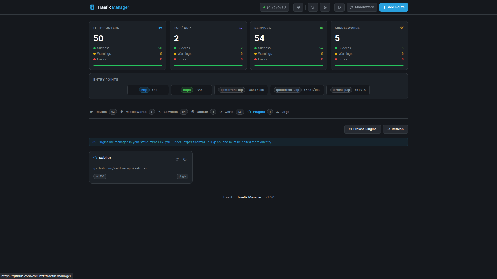
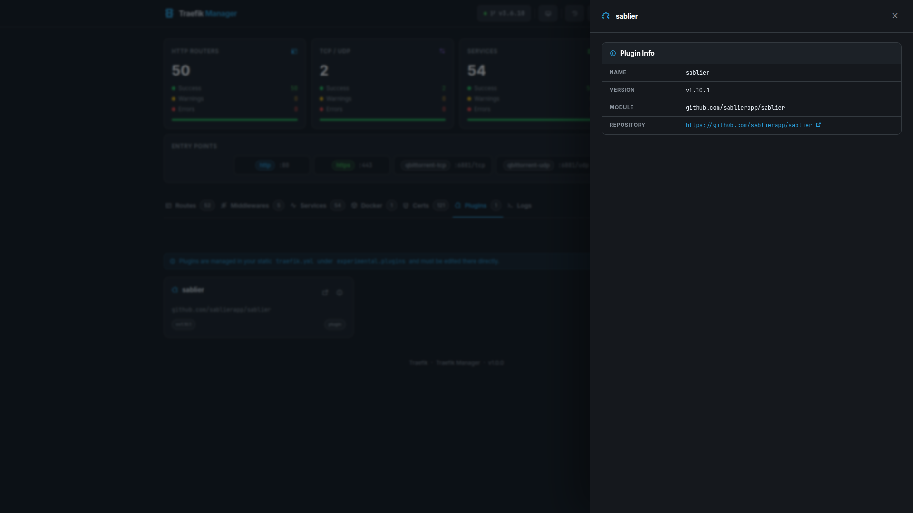
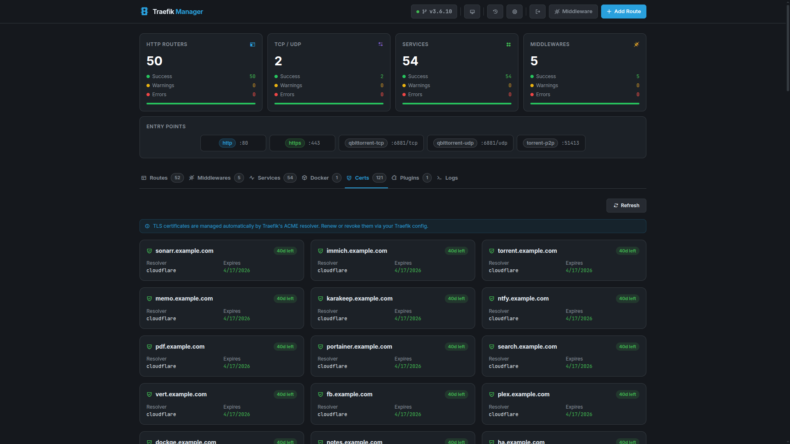
</p>
<p align="center">View active Go plugins and monitor TLS certificate expiration dates.</p>
</details>

<details>
<summary><b>System Settings</b></summary>
<p align="center">
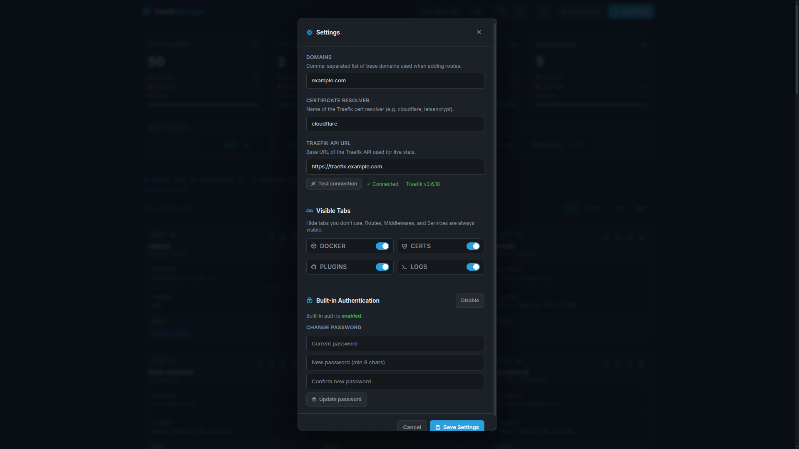
</p>
<p align="center">Manage authentication, domain visibility, and UI customization.</p>
</details>

---

## Features

- **Route management** - add, edit, and delete HTTP, TCP, and UDP routes via a simple form
- **Middleware management** - create and manage Traefik middlewares with built-in templates (Basic Auth, Forward Auth, Redirect, Strip Prefix)
- **Live dashboard** - real-time stats pulled from the Traefik API: router counts, service health, entrypoints, and version
- **TLS certificates** - view all certificates from `acme.json` with expiry tracking
- **Plugin viewer** - inspect plugins configured in your static `traefik.yml`
- **Access logs** - stream and filter Traefik access logs in the browser
- **Docker routes view** - see all routes discovered via Docker labels pulled directly from the Traefik API
- **Kubernetes routes view** - see all routes managed by Kubernetes (CRD, Ingress, Gateway API) pulled from the Traefik API
- **Swarm routes view** - see all routes discovered via Docker Swarm service labels pulled from the Traefik API
- **Nomad routes view** - see all routes discovered via HashiCorp Nomad pulled from the Traefik API
- **ECS routes view** - see all routes discovered via Amazon ECS pulled from the Traefik API
- **Consul Catalog routes view** - see all routes discovered via Consul service catalog pulled from the Traefik API
- **Redis routes view** - see all routes stored in Redis KV pulled from the Traefik API
- **etcd routes view** - see all routes stored in etcd KV pulled from the Traefik API
- **Consul KV routes view** - see all routes stored in Consul's key-value store pulled from the Traefik API
- **ZooKeeper routes view** - see all routes stored in ZooKeeper KV pulled from the Traefik API
- **HTTP provider routes view** - see all routes sourced from an HTTP endpoint pulled from the Traefik API
- **File (external) routes view** - see routes from external file provider configurations (traefik-manager's own routes are excluded to avoid duplication)
- **Automatic backups** - every config change creates a timestamped backup of `dynamic.yml`
- **Built-in auth** - password-protected with bcrypt hashing, session management, and CSRF protection
- **Auto-generated password** - a secure temporary password is printed to logs on first start; forced password-change flow afterwards
- **CLI password reset** - `docker exec traefik-manager flask reset-password` generates a new temporary password instantly
- **First-run setup wizard** - configure everything (domains, API URL, cert resolver, visible tabs) on first launch
- **Dark / light theme** - persisted per browser
- **PWA** - Install as a web app on mobile devices and manage traefik on the go

---

## Requirements

- Docker + Docker Compose (or Podman - see [docs/podman.md](docs/podman.md))
- A running [Traefik v2/v3](https://traefik.io/) instance
- Traefik's `dynamic.yml` file accessible on the host

---

## Quick Start

### Using the pre-built image (recommended)

Create a `docker-compose.yml`:

```yaml
services:
  traefik-manager:
    image: ghcr.io/chr0nzz/traefik-manager:latest
    container_name: traefik-manager
    restart: unless-stopped
    ports:
      - "5000:5000"
    environment:
      - COOKIE_SECURE=true
    volumes:
      - /path/to/traefik/dynamic.yml:/app/config/dynamic.yml
      - /path/to/traefik-manager/config:/app/config
      - /path/to/traefik-manager/backups:/app/backups
```

Then run:

```bash
docker compose up -d
```

Open **http://your-server:5000** - the setup wizard will guide you through the rest.

---

## Volume Mounts

| Host path | Container path | Required | Purpose |
|---|---|---|---|
| `/path/to/traefik/dynamic.yml` | `/app/config/dynamic.yml` | ✅ | Traefik dynamic config - this is what Traefik Manager reads and writes |
| `/path/to/traefik-manager/config` | `/app/config` | ✅ | Persists `manager.yml` (settings) and the session secret key |
| `/path/to/traefik-manager/backups` | `/app/backups` | ✅ | Stores timestamped backups of `dynamic.yml` before every change |
| `/path/to/traefik/acme.json` | `/app/acme.json` | Optional | Enables the **Certs** tab |
| `/path/to/traefik/traefik.yml` | `/app/traefik.yml` | Optional | Enables the **Plugins** tab |
| `/path/to/traefik/logs/access.log` | `/app/logs/access.log` | Optional | Enables the **Logs** tab |

---

## Optional Monitoring Tabs

Traefik Manager includes optional views that can be enabled during the setup wizard or toggled anytime in **Settings → Visible Tabs**. API-based tabs (Docker, Kubernetes, Swarm, Nomad, ECS, Consul Catalog, Redis, etcd, Consul KV, ZooKeeper, HTTP Provider, File external) require no extra mounts - just a working Traefik API connection. File-based tabs (Certs, Plugins, Logs) will show the exact volume line to add if the file is not yet mounted.

See [docs/README.md](docs/README.md) for the full tab reference and `traefik.yml` configuration snippets for every provider.

### Docker tab

No extra configuration needed. Enable the tab in Settings and routes discovered via Docker labels will appear automatically (requires a working Traefik API connection).

### Kubernetes tab

Enable the tab in Settings. Routes discovered by any Kubernetes provider (CRD, Ingress, or Gateway API) will appear automatically. Traefik must be configured with at least one Kubernetes provider in your `traefik.yml`:

```yaml
providers:
  kubernetesCRD: {}
  kubernetesIngress: {}
```

No extra file mounts into the traefik-manager container are needed.

### Swarm tab

No extra configuration needed beyond the Swarm provider in your `traefik.yml`. Routes discovered via Docker Swarm service labels will appear automatically.

### Nomad tab

Requires the Nomad provider configured in your `traefik.yml`. Routes discovered via HashiCorp Nomad will appear automatically.

### ECS tab

Requires the ECS provider configured in your `traefik.yml`. Routes discovered via Amazon ECS task labels will appear automatically.

### Consul Catalog tab

Requires the Consul Catalog provider configured in your `traefik.yml`. Routes registered in the Consul service catalog with Traefik tags will appear automatically.

### Redis tab

Requires the Redis provider configured in your `traefik.yml`. Routes stored in Redis KV will appear automatically.

### etcd tab

Requires the etcd provider configured in your `traefik.yml`. Routes stored in etcd will appear automatically.

### Consul KV tab

Requires the Consul KV provider configured in your `traefik.yml`. Routes stored in Consul's key-value store will appear automatically. This is distinct from the Consul Catalog tab which uses service discovery.

### ZooKeeper tab

Requires the ZooKeeper provider configured in your `traefik.yml`. Routes stored in ZooKeeper will appear automatically.

### HTTP Provider tab

Requires the HTTP provider configured in your `traefik.yml`:

```yaml
providers:
  http:
    endpoint: "https://my-config-server/traefik-config"
    pollInterval: "5s"
```

Routes sourced from the configured HTTP endpoint will appear automatically.

### File (external) tab

Shows routes from Traefik's file provider that are not managed by traefik-manager. Routes that traefik-manager manages (stored in `dynamic.yml`) are shown in the main Routes tab and are automatically excluded from this view to avoid duplication.

Requires the file provider configured in your `traefik.yml`:

```yaml
providers:
  file:
    directory: "/etc/traefik/conf.d"
    watch: true
```

No extra file mounts into the traefik-manager container are needed - data is pulled live from the Traefik API.

### Certs tab

Mount your `acme.json` read-only:

```yaml
volumes:
  - /path/to/traefik/acme.json:/app/acme.json:ro
```

### Plugins tab

Mount your Traefik static config read-only:

```yaml
volumes:
  - /path/to/traefik/traefik.yml:/app/traefik.yml:ro
```

### Logs tab

First, enable access logging in your `traefik.yml`:

```yaml
accessLog:
  filePath: "/logs/access.log"
```

Then mount the log file into the traefik-manager container:

```yaml
volumes:
  - /path/to/traefik/logs/access.log:/app/logs/access.log:ro
```

> Traefik must be restarted after adding `accessLog` to `traefik.yml`. Traefik Manager does not need to restart for any of these mounts.

---

## Full compose example (all monitoring enabled)

```yaml
services:
  traefik-manager:
    image: ghcr.io/chr0nzz/traefik-manager:latest
    container_name: traefik-manager
    restart: unless-stopped
    ports:
      - "5000:5000"
    environment:
      - COOKIE_SECURE=true
    volumes:
      # Required
      - /path/to/traefik/dynamic.yml:/app/config/dynamic.yml
      - /path/to/traefik-manager/config:/app/config
      - /path/to/traefik-manager/backups:/app/backups
      # Optional monitoring
      - /path/to/traefik/acme.json:/app/acme.json:ro
      - /path/to/traefik/traefik.yml:/app/traefik.yml:ro
      - /path/to/traefik/logs/access.log:/app/logs/access.log:ro
```

---

## Behind Traefik (expose via subdomain)

To expose Traefik Manager through Traefik itself, remove the `ports` mapping and add labels:

```yaml
services:
  traefik-manager:
    image: ghcr.io/chr0nzz/traefik-manager:latest
    container_name: traefik-manager
    restart: unless-stopped
    environment:
      - COOKIE_SECURE=true
    volumes:
      - /path/to/traefik/dynamic.yml:/app/config/dynamic.yml
      - /path/to/traefik-manager/config:/app/config
      - /path/to/traefik-manager/backups:/app/backups
    labels:
      - "traefik.enable=true"
      - "traefik.http.routers.traefik-manager.rule=Host(`manager.example.com`)"
      - "traefik.http.routers.traefik-manager.entrypoints=https"
      - "traefik.http.routers.traefik-manager.tls.certresolver=cloudflare"
      - "traefik.http.services.traefik-manager.loadbalancer.server.port=5000"
    networks:
      - traefik

networks:
  traefik:
    external: true
```

> `COOKIE_SECURE=true` is required when running behind HTTPS so the session cookie is sent correctly.

---

## Building from source

### With Docker Compose

```bash
git clone https://github.com/chr0nzz/traefik-manager.git
cd traefik-manager
```

Edit the volumes in `docker-compose.yml` to match your paths, then:

```bash
docker compose up -d --build
```

### With Docker directly

```bash
git clone https://github.com/chr0nzz/traefik-manager.git
cd traefik-manager

docker build -t traefik-manager .

docker run -d \
  --name traefik-manager \
  --restart unless-stopped \
  -p 5000:5000 \
  -e COOKIE_SECURE=true \
  -v /path/to/traefik/dynamic.yml:/app/config/dynamic.yml \
  -v /path/to/traefik-manager/config:/app/config \
  -v /path/to/traefik-manager/backups:/app/backups \
  traefik-manager
```

---

## First-run setup

On first launch a **temporary password is auto-generated** and printed to the container logs:

```
docker compose logs traefik-manager | grep -A3 "AUTO-GENERATED"
```

Use that password to log in. You'll then go through a quick setup wizard:

1. **Connection & domains** - enter your base domains (e.g. `example.com, example.net`), certificate resolver name, and the internal Traefik API URL (usually `http://traefik:8080` on the same Docker network). Use the **Test connection** button to verify before proceeding.
2. **Optional monitoring** - toggle on any optional views (Docker, Kubernetes, Certs, Plugins, Logs). You can change these anytime in Settings.

After the wizard you'll be prompted to **set a permanent password** before accessing the dashboard.

All settings are saved to `manager.yml` inside the config volume. The setup wizard only runs once.

### Pre-configuring manager.yml (skip the wizard)

You can bypass the setup wizard entirely by pre-populating `manager.yml` before the first start:

1. Generate a bcrypt password hash:
   ```bash
   python3 -c "import bcrypt; print(bcrypt.hashpw(b'yourpassword', bcrypt.gensalt()).decode())"
   ```
2. Edit `manager.yml` in your config volume:
   ```yaml
   domains:
     - yourdomain.com
   cert_resolver: cloudflare
   traefik_api_url: http://traefik:8080
   password_hash: "$2b$12$..."   # paste hash here
   setup_complete: true
   must_change_password: false
   ```
3. Start the container - the wizard and auto-generation are skipped.

---

## Resetting your password

### Using the CLI (recommended)

```bash
docker exec traefik-manager flask reset-password
```

This generates a new temporary password, prints it to the terminal, and requires you to change it on next login.

### Manual reset

If you cannot exec into the container, remove the `password_hash` from `manager.yml` and also set `setup_complete: false`. Then restart the container - a new temporary password will be auto-generated and printed to the logs.

```bash
nano /path/to/traefik-manager/config/manager.yml
# Remove or blank password_hash, set setup_complete: false
docker restart traefik-manager
docker compose logs traefik-manager | grep -A3 "AUTO-GENERATED"
```

---

## Disabling built-in auth

If you're protecting Traefik Manager externally via Authentik, Authelia, or a Traefik `basicAuth` middleware, you can disable the built-in auth entirely:

```yaml
environment:
  - AUTH_ENABLED=false
```

---

## Configurable paths

By default the container uses these paths:

| Purpose | Default path | Override via env var |
|---|---|---|
| Traefik dynamic config | `/app/config/dynamic.yml` | `CONFIG_PATH` |
| Backup directory | `/app/backups` | `BACKUP_DIR` |
| Manager settings | `/app/config/manager.yml` | `SETTINGS_PATH` |

Example - useful for non-standard volume layouts. For Podman-specific setup see [docs/podman.md](docs/podman.md).

```yaml
environment:
  - CONFIG_PATH=/data/traefik/dynamic.yml
  - BACKUP_DIR=/data/traefik-manager/backups
  - SETTINGS_PATH=/data/traefik-manager/manager.yml
```

---

## How it works

Traefik Manager reads and writes Traefik's `dynamic.yml` file directly. Since Traefik watches this file for changes, routes take effect immediately - no Traefik restart needed.

The Traefik API (read-only) is used to pull live stats, service health, router details, and version information shown in the dashboard.

Every time you save or delete a route or middleware, a timestamped backup of `dynamic.yml` is created in the backups directory before the change is written. You can restore any backup from the Settings panel.

---

## Tech stack

| Layer | Technology |
|---|---|
| Backend | Python 3.11 · Flask · Gunicorn |
| Config parsing | ruamel.yaml (preserves comments and formatting) |
| Auth | bcrypt · Flask sessions · CSRF protection |
| Frontend | Vanilla JS · Tailwind CSS (CDN) · Phosphor Icons |
| Container | Docker · Alpine Linux |

---

## Contributing

Pull requests are welcome. For larger changes, please open an issue first to discuss what you'd like to change.

---

## License

[GPL-3.0 license](LICENSE)
