<div align="center">


# Traefik Manager

**A clean, self-hosted web UI for managing your Traefik reverse proxy.**

Add routes, manage middlewares, monitor services, and view TLS certificates - all without touching a YAML file by hand.

[](https://github.com/chr0nzz/traefik-manager/pkgs/container/traefik-manager)
[](LICENSE)
[](https://github.com/chr0nzz/traefik-manager/releases)
[](https://traefik-manager.xyzlab.dev/)
[](https://github.com/chr0nzz/traefik-manager-mobile)
[](https://play.google.com/store/apps/details?id=dev.chr0nzz.traefikmanager)
[](https://ko-fi.com/chr0nzz)

</div>
<div align="center">
<sub>Built for homelabbers who love Traefik but hate editing YAML at 2am.</sub>
</div>

---

## Interface Gallery

<details>
<summary><b>Initial Setup Workflow</b></summary>
<table>
<tr>
<td width="33%">
<a href="docs/public/images/dark-login.png" target="_blank"><picture>
  <source media="(prefers-color-scheme: dark)" srcset="docs/public/images/dark-login.png">
  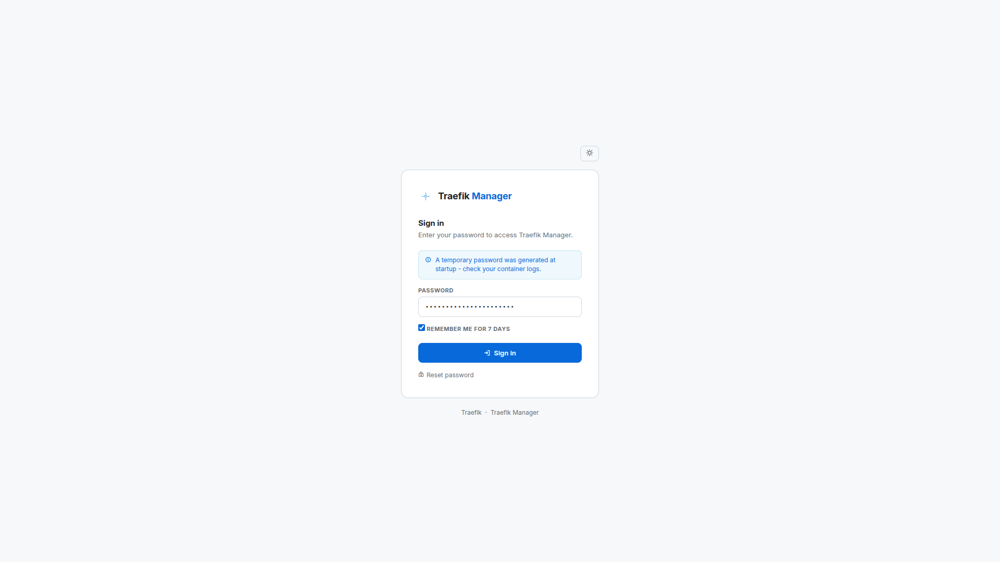
</picture></a>
<br /><b>1. Login</b>
</td>
<td width="33%">
<a href="docs/public/images/dark-setup-welcome.png" target="_blank"><picture>
  <source media="(prefers-color-scheme: dark)" srcset="docs/public/images/dark-setup-welcome.png">
  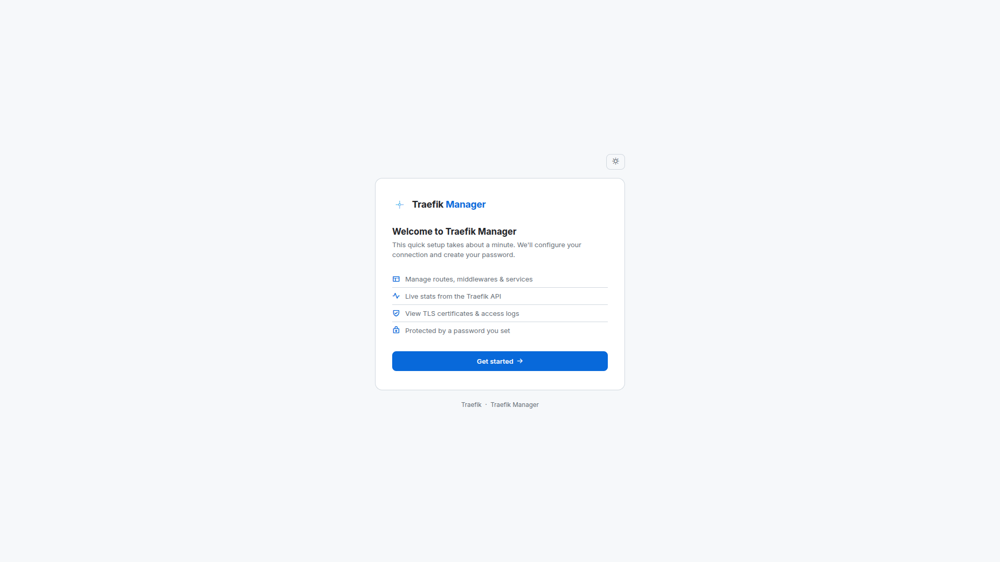
</picture></a>
<br /><b>2. Welcome</b>
</td>
<td width="33%">
<a href="docs/public/images/dark-setup-connection.png" target="_blank"><picture>
  <source media="(prefers-color-scheme: dark)" srcset="docs/public/images/dark-setup-connection.png">
  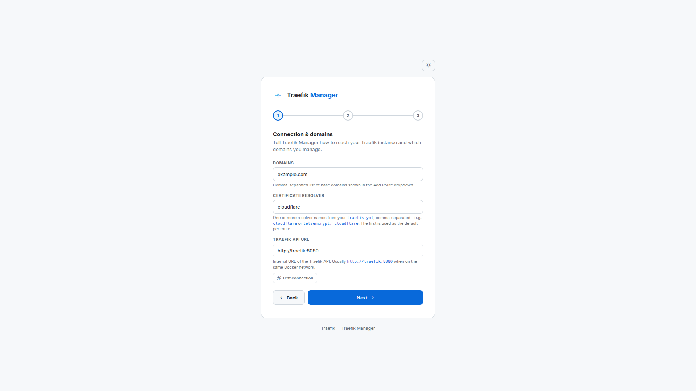
</picture></a>
<br /><b>3. Connection &amp; domains</b>
</td>
</tr>
<tr>
<td>
<a href="docs/public/images/dark-setup-self-route.png" target="_blank"><picture>
  <source media="(prefers-color-scheme: dark)" srcset="docs/public/images/dark-setup-self-route.png">
  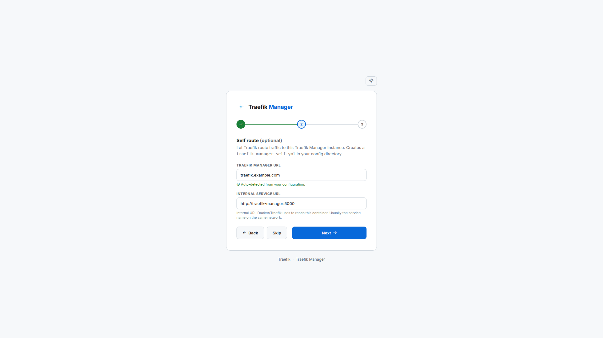
</picture></a>
<br /><b>4. Self route</b>
</td>
<td>
<a href="docs/public/images/dark-setup-monitoring.png" target="_blank"><picture>
  <source media="(prefers-color-scheme: dark)" srcset="docs/public/images/dark-setup-monitoring.png">
  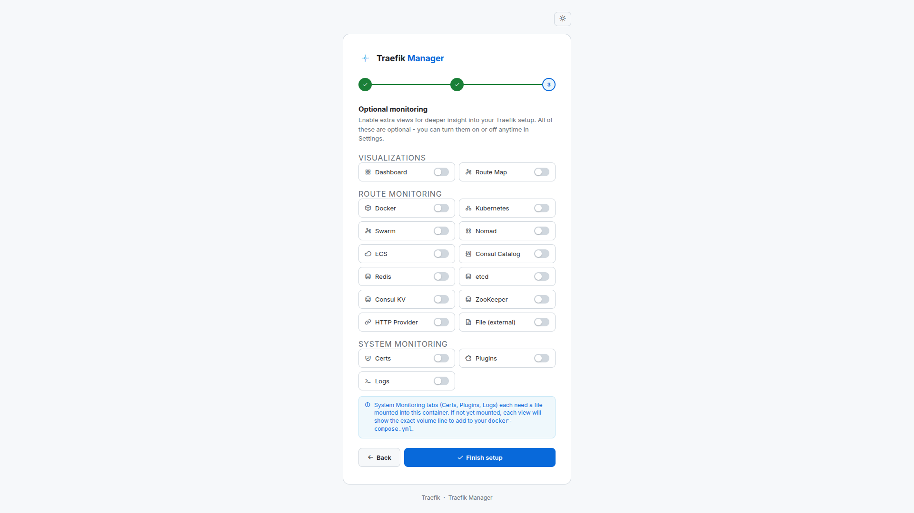
</picture></a>
<br /><b>5. Optional tabs</b>
</td>
<td>
<a href="docs/public/images/dark-setup-password.png" target="_blank"><picture>
  <source media="(prefers-color-scheme: dark)" srcset="docs/public/images/dark-setup-password.png">
  
</picture></a>
<br /><b>6. Set password</b>
</td>
</tr>
</table>
</details>

<details>
<summary><b>Dashboard</b></summary>
<p align="center">
<a href="docs/public/images/dark-dashboard.png" target="_blank"><picture>
  <source media="(prefers-color-scheme: dark)" srcset="docs/public/images/dark-dashboard.png">
  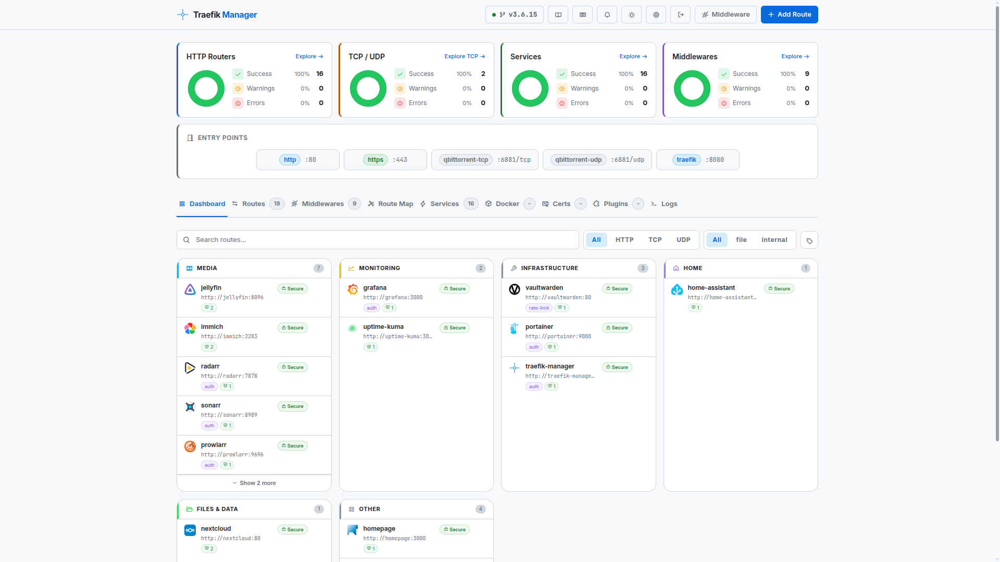
</picture></a>
</p>
</details>

<details>
<summary><b>Routes</b></summary>
<table>
<tr>
<td width="33%">
<a href="docs/public/images/dark-routes-cards.png" target="_blank"><picture>
  <source media="(prefers-color-scheme: dark)" srcset="docs/public/images/dark-routes-cards.png">
  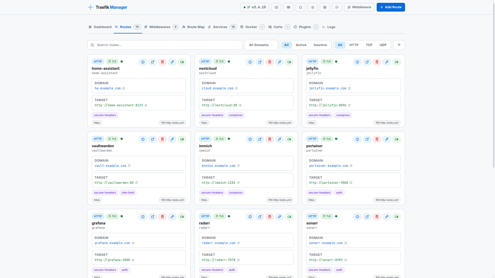
</picture></a>
<br /><b>Card View</b>
</td>
<td width="33%">
<a href="docs/public/images/dark-routes-list.png" target="_blank"><picture>
  <source media="(prefers-color-scheme: dark)" srcset="docs/public/images/dark-routes-list.png">
  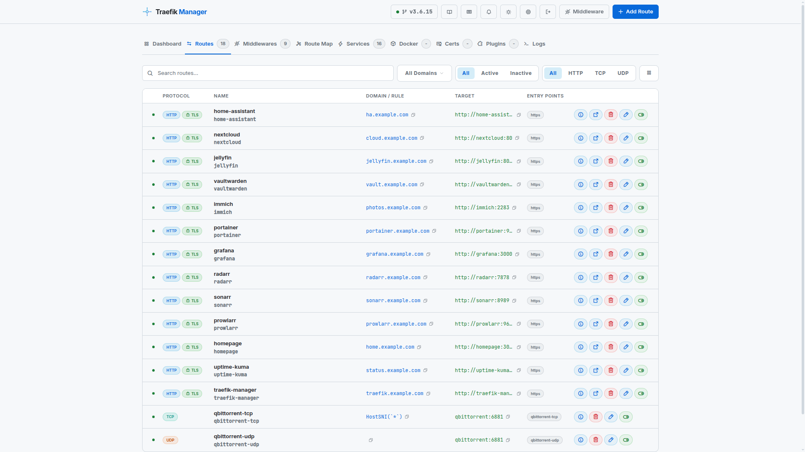
</picture></a>
<br /><b>List View</b>
</td>
<td width="33%">
<a href="docs/public/images/dark-routes-add-http.png" target="_blank"><picture>
  <source media="(prefers-color-scheme: dark)" srcset="docs/public/images/dark-routes-add-http.png">
  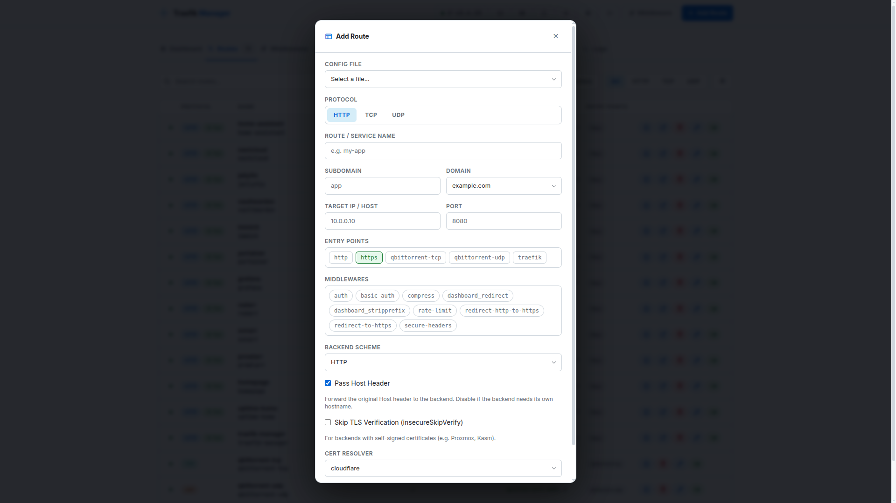
</picture></a>
<br /><b>Add HTTP</b>
</td>
</tr>
<tr>
<td>
<a href="docs/public/images/dark-routes-add-tcp.png" target="_blank"><picture>
  <source media="(prefers-color-scheme: dark)" srcset="docs/public/images/dark-routes-add-tcp.png">
  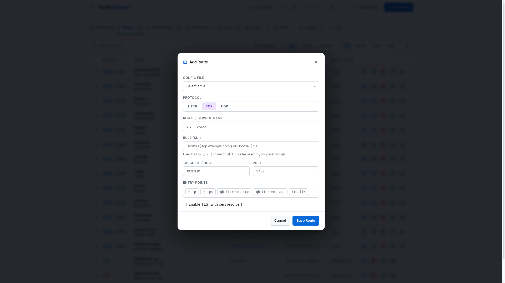
</picture></a>
<br /><b>Add TCP</b>
</td>
<td>
<a href="docs/public/images/dark-routes-add-udp.png" target="_blank"><picture>
  <source media="(prefers-color-scheme: dark)" srcset="docs/public/images/dark-routes-add-udp.png">
  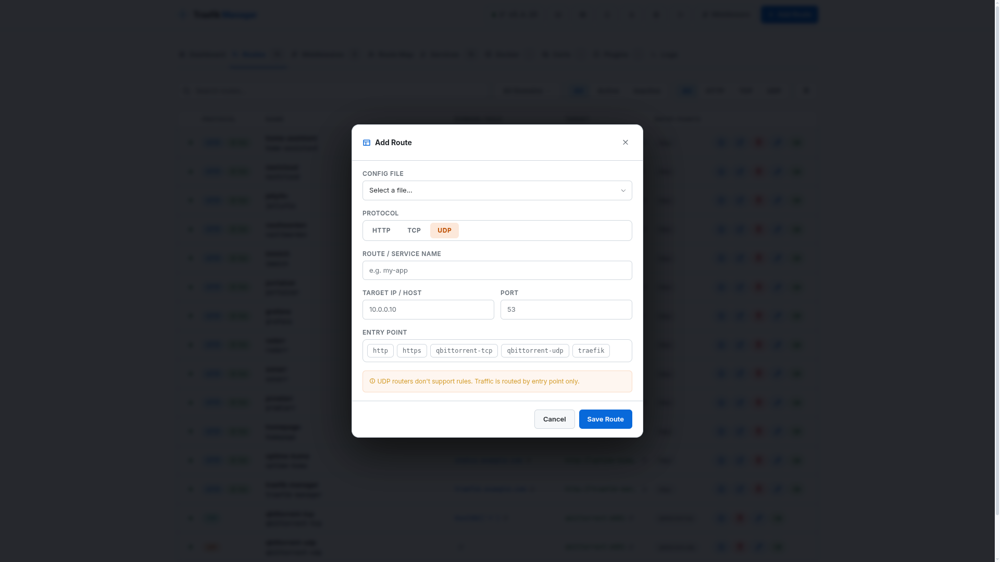
</picture></a>
<br /><b>Add UDP</b>
</td>
<td></td>
</tr>
</table>
</details>

<details>
<summary><b>Services</b></summary>
<p align="center">
<a href="docs/public/images/dark-services-cards.png" target="_blank"><picture>
  <source media="(prefers-color-scheme: dark)" srcset="docs/public/images/dark-services-cards.png">
  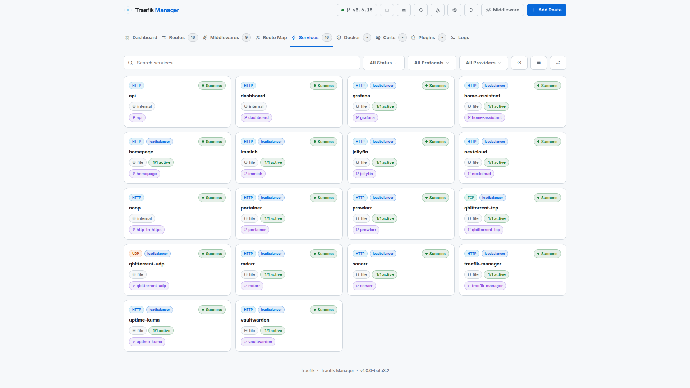
</picture></a>
<a href="docs/public/images/dark-services-list.png" target="_blank"><picture>
  <source media="(prefers-color-scheme: dark)" srcset="docs/public/images/dark-services-list.png">
  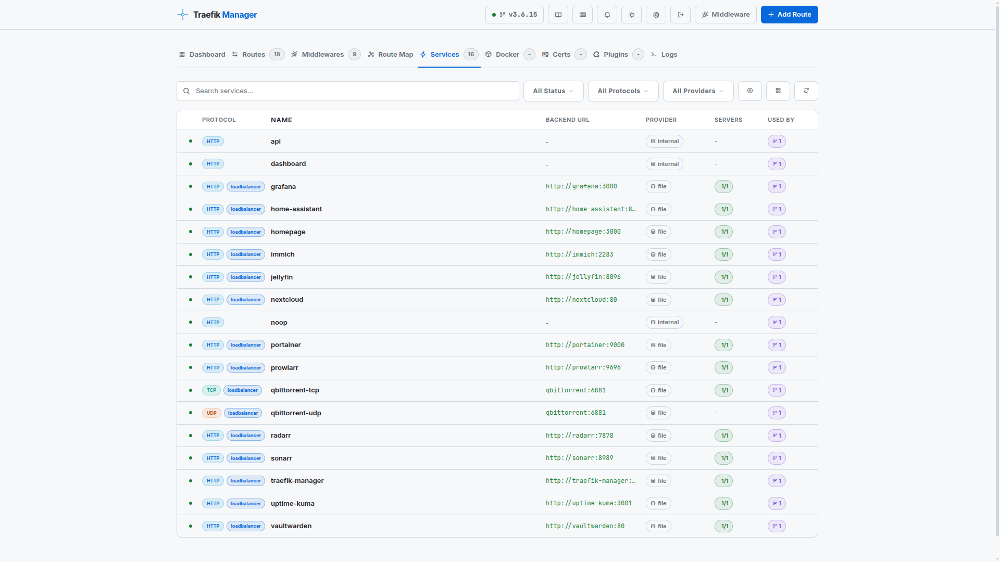
</picture></a>
</p>
</details>

<details>
<summary><b>Middlewares</b></summary>
<table>
<tr>
<td width="33%">
<a href="docs/public/images/dark-middlewares-cards.png" target="_blank"><picture>
  <source media="(prefers-color-scheme: dark)" srcset="docs/public/images/dark-middlewares-cards.png">
  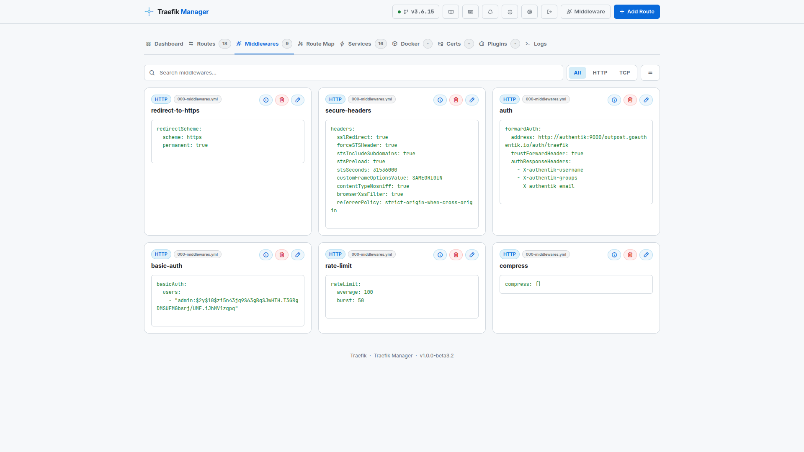
</picture></a>
<br /><b>Card View</b>
</td>
<td width="33%">
<a href="docs/public/images/dark-middlewares-list.png" target="_blank"><picture>
  <source media="(prefers-color-scheme: dark)" srcset="docs/public/images/dark-middlewares-list.png">
  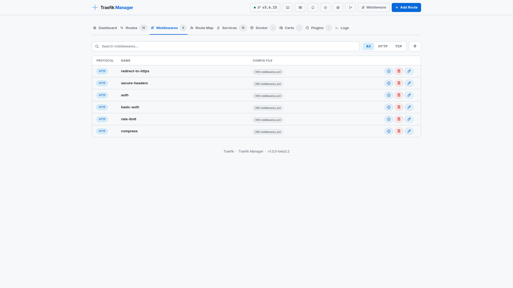
</picture></a>
<br /><b>List View</b>
</td>
<td width="33%">
<a href="docs/public/images/dark-middlewares-add.png" target="_blank"><picture>
  <source media="(prefers-color-scheme: dark)" srcset="docs/public/images/dark-middlewares-add.png">
  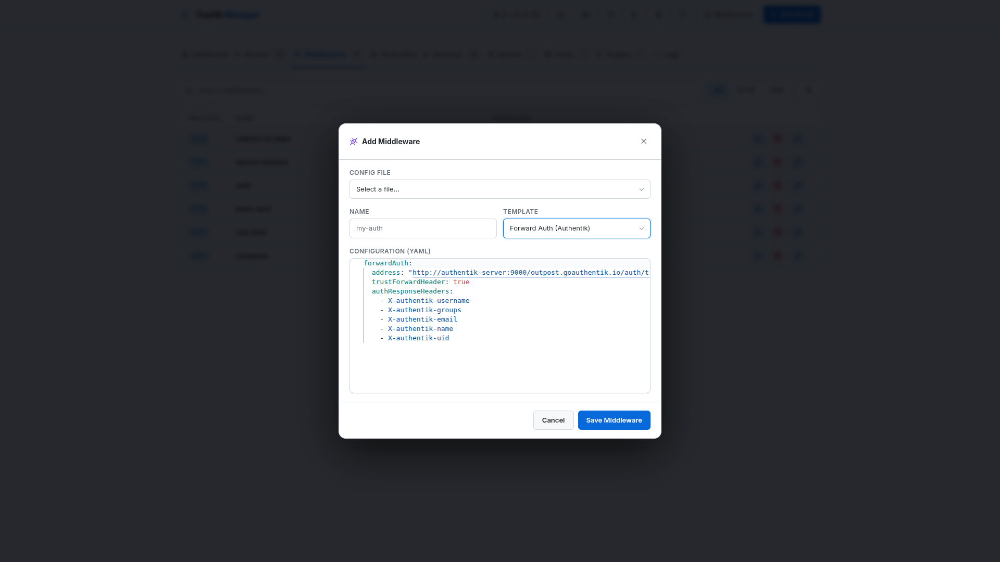
</picture></a>
<br /><b>Add</b>
</td>
</tr>
</table>
</details>

<details>
<summary><b>Plugins</b></summary>
<p align="center">
<a href="docs/public/images/dark-plugins.png" target="_blank"><picture>
  <source media="(prefers-color-scheme: dark)" srcset="docs/public/images/dark-plugins.png">
  
</picture></a>
<a href="docs/public/images/dark-plugins-add.png" target="_blank"><picture>
  <source media="(prefers-color-scheme: dark)" srcset="docs/public/images/dark-plugins-add.png">
  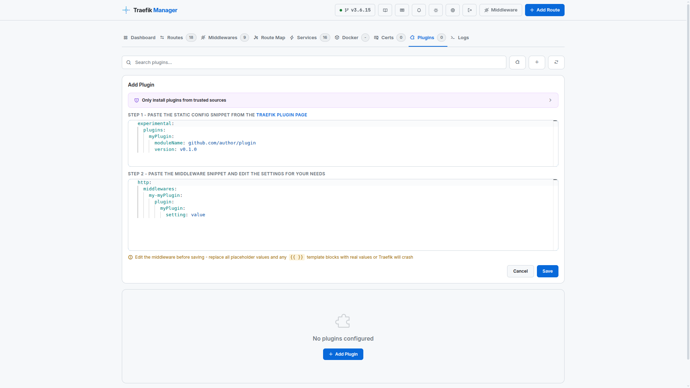
</picture></a>
</p>
</details>


<details>
<summary><b>Route Map</b></summary>
<p align="center">
<a href="docs/public/images/dark-route-map.png" target="_blank"><picture>
  <source media="(prefers-color-scheme: dark)" srcset="docs/public/images/dark-route-map.png">
  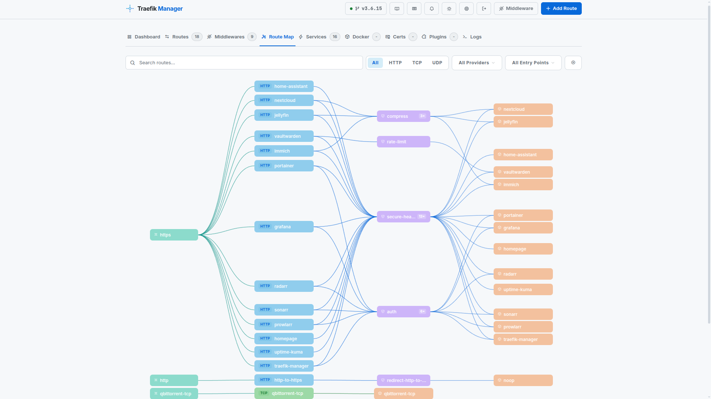
</picture></a>
</p>
</details>

<details>
<summary><b>Settings</b></summary>
<table>
<tr>
<td width="33%">
<a href="docs/public/images/dark-settings-interface.png" target="_blank"><picture>
  <source media="(prefers-color-scheme: dark)" srcset="docs/public/images/dark-settings-interface.png">
  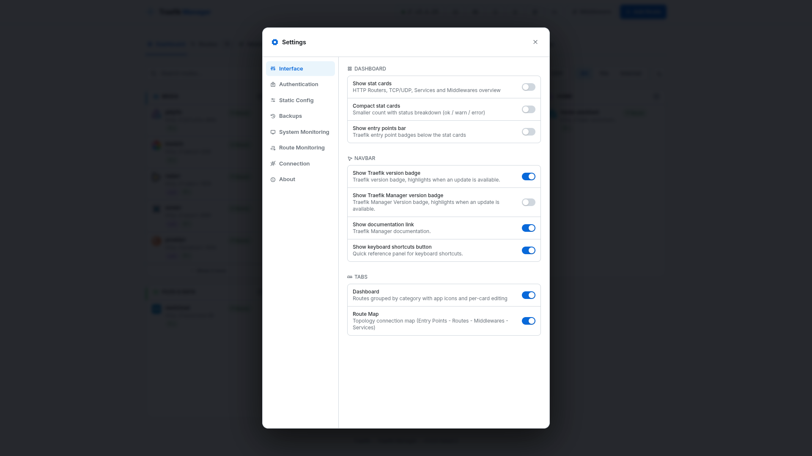
</picture></a>
<br /><b>Interface</b>
</td>
<td width="33%">
<a href="docs/public/images/dark-settings-auth-password.png" target="_blank"><picture>
  <source media="(prefers-color-scheme: dark)" srcset="docs/public/images/dark-settings-auth-password.png">
  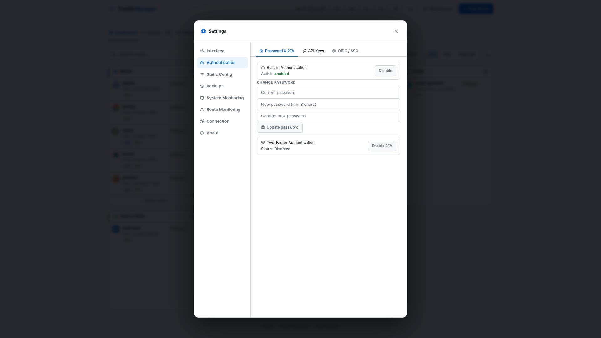
</picture></a>
<br /><b>Authentication</b>
</td>
<td width="33%">
<a href="docs/public/images/dark-settings-auth-apikeys.png" target="_blank"><picture>
  <source media="(prefers-color-scheme: dark)" srcset="docs/public/images/dark-settings-auth-apikeys.png">
  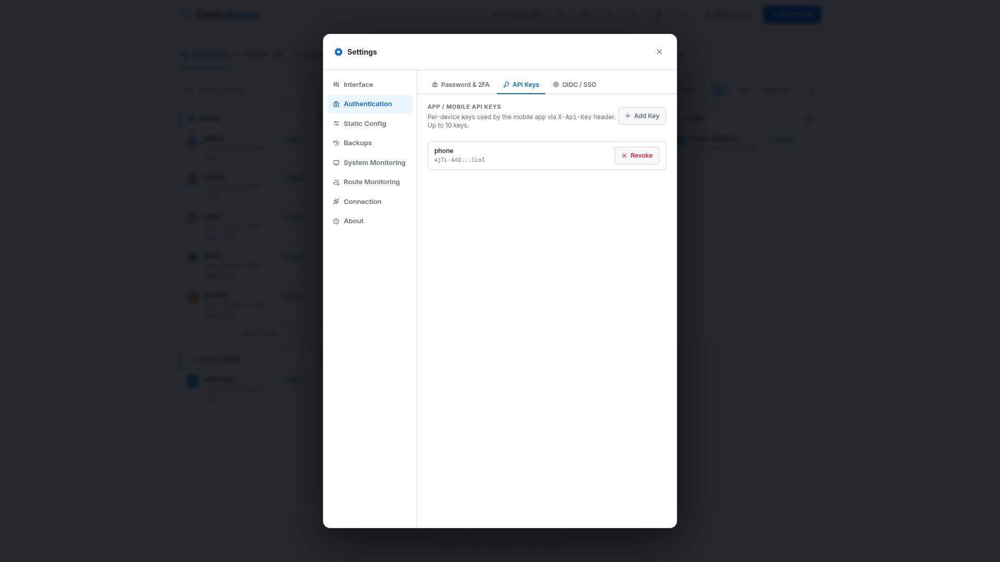
</picture></a>
<br /><b>API Keys</b>
</td>
</tr>
<tr>
<td>
<a href="docs/public/images/dark-settings-static-config.png" target="_blank"><picture>
  <source media="(prefers-color-scheme: dark)" srcset="docs/public/images/dark-settings-static-config.png">
  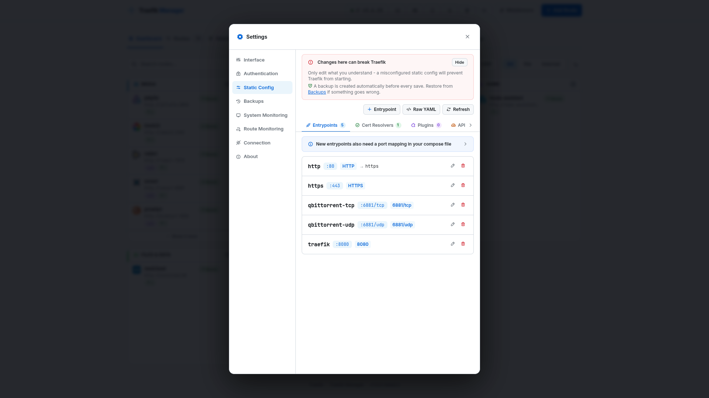
</picture></a>
<br /><b>Static Config</b>
</td>
<td>
<a href="docs/public/images/dark-settings-connection.png" target="_blank"><picture>
  <source media="(prefers-color-scheme: dark)" srcset="docs/public/images/dark-settings-connection.png">
  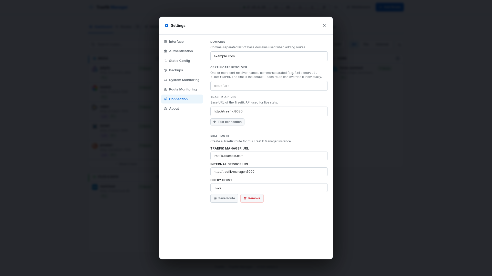
</picture></a>
<br /><b>Connection</b>
</td>
<td>
<a href="docs/public/images/dark-settings-backups.png" target="_blank"><picture>
  <source media="(prefers-color-scheme: dark)" srcset="docs/public/images/dark-settings-backups.png">
  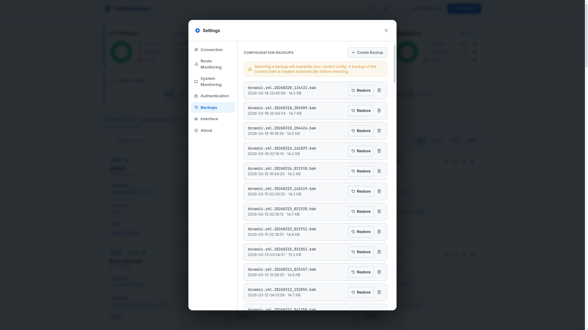
</picture></a>
<br /><b>Backups</b>
</td>
</tr>
</table>
</details>

---

## Features

**Routing & Middleware**
- Add, edit, delete, and **enable/disable** HTTP, TCP, and UDP routes - no YAML editing required
- **Advanced rule editor** - toggle between a domain chip builder and a free-text rule input for complex expressions (`PathPrefix`, `HostRegexp`, `&&` / `||` compounds, etc.)
- **Multiple domains per route** - select any combination of your configured domains; generates multi-host Traefik rules (`Host(\`sub.d1\`) || Host(\`sub.d2\`)`)
- **Per-service insecureSkipVerify** - checkbox adds a named `serversTransport` for backends with self-signed certs (Proxmox, Kasm, etc.); yellow TLS skip badge shown on route cards
- **Wildcard certificate domains** - "Request wildcard certificate" checkbox auto-fills `tls.domains` from the selected domain; use with DNS challenge resolvers to request `*.domain.com` certs
- **TLS Options tab** - create and manage named `tls.options` profiles (min/max version, cipher suites, curve preferences, SNI strict, ALPN, mTLS client auth); assign a profile to any route via the route form
- **23 middleware wizard templates** with guided form fields (Basic Auth, Forward Auth, Rate Limit, IP Allowlist, Secure Headers, CORS, Redirect, Strip/Add Prefix, Retry, Circuit Breaker, Buffering, and more) - toggle to raw YAML for anything else
- **Route clone** - duplicate a route into the add modal pre-filled with its service URL, middlewares, and entrypoints
- **Multi-config file support** - mount several dynamic config files with `CONFIG_DIR` or `CONFIG_PATHS`; a dropdown selects which file each route or middleware is saved to; **create new files on the fly** when `CONFIG_DIR` is set
- **Timestamped backups** before every change; one-click restore from Settings; `POST /api/backup/create` and `POST /api/backup/static/create` for automation
- **Git Repository Backup** - push your Traefik configuration to a remote Git repository (GitHub, Gitea, Forgejo, GitLab, or any HTTPS host) after every change; browse the full commit history, view per-file side-by-side diffs, and restore any commit with one click; access token stored encrypted at rest; auto-push on every route, middleware, or static config save; manual push and Test Connection available in Settings → Backups → Git
- **App icons on routes** *(optional, off by default)* - toggle in Settings → Interface → Routes to show an app icon next to each route name in grid and list view, reusing the Dashboard's selfh.st icons and per-route custom overrides; applies to the Host and remote agents

**Live Dashboard**
- Real-time stats: router counts, service health, entrypoints, Traefik version
- Provider tabs: Docker, Kubernetes, Swarm, Nomad, ECS, Consul Catalog, Redis, etcd, Consul KV, ZooKeeper, HTTP Provider, File - all API-based, no extra mounts; **each tab shows provider middlewares** in a read-only section
- **Filter live services** by protocol (HTTP/TCP/UDP) and provider (docker, file, kubernetes…)
- **List view toggle** on Routes, Middlewares, and Services tabs - switch between card grid and compact table

**Visualizations** *(optional, toggle in Settings)*
- **Dashboard tab** - routes grouped by category (Media, Monitoring, Infrastructure, etc.) with app icons sourced from [selfh.st/icons](https://selfh.st/icons/), cached locally, and per-card editing (display name, icon override, group override)
- **Route Map tab** - 4-column topology view (Entry Points - Routes - Middlewares - Services) with Bezier curve connections, hover-to-highlight, and route tooltips

**Static Config Editor** *(optional - mount `traefik.yml` read-write)*
- Edit Traefik's static configuration directly from the UI - entrypoints, certificate resolvers, plugins, and a raw YAML editor (Monaco/VS Code engine) for anything else
- Changes are staged with a pending banner, backed up before saving, and Traefik is restarted automatically
- Three restart methods: **socket proxy** (recommended - sidecar with minimal socket exposure), **poison pill** (no socket needed - shared signal file), **direct socket**
- Full-screen reconnect overlay polls until Traefik is back up and dismisses automatically

**System Monitoring** *(optional)*
- **Certs** - `acme.json` certificates with expiry tracking
- **Plugins** - plugins from your static `traefik.yml`; add, edit, and remove plugins when static config editor is enabled
- **Logs** - parsed access log cards showing method, status, path, IP, service, and duration; click any card for a full detail panel with all fields and the raw log line
- **CrowdSec** - active decisions and recent alerts from a CrowdSec LAPI; add manual bans/captchas/bypasses or unban IPs with one click; stats cards show total alerts, active decisions, LAPI status, and type breakdown. Configure via `CROWDSEC_LAPI_URL` / `CROWDSEC_API_KEY` env vars or **Settings → System Monitoring → CrowdSec**
- **Configurable file paths** - set `acme.json`, access log, and static config paths from **Settings → File Paths** without a container restart; UI setting takes priority over env vars

**Multi-Server Management**
- **Traefik Manager Agent (TMA)** - lightweight Go daemon that runs alongside Traefik on any remote server; install it in seconds with the one-liner installer
- **Server switcher** in the nav bar - switch between local and remote agents; all data tabs show that server's routes, services, middlewares, backups, and logs
- **Settings → Agents** multi-step wizard - generates a ready-to-paste Docker Compose or Docker Run command with all env vars pre-filled; API key shown once and stored encrypted
- **Per-server git backup** - each agent handles its own autonomous git cycle via env vars; viewed from TM when that agent is active
- Manage unlimited remote Traefik instances from a single TM - no VPN or SSH required

**Security**
- bcrypt passwords (cost 12), CSRF protection, session management with session fixation protection
- Optional TOTP 2FA · 7-day remember me · configurable inactivity timeout
- Auto-generated password on first start · CLI recovery with `flask reset-password`
- **OIDC / SSO** - sign in with Keycloak, Google, Authentik, or any OIDC-compliant provider alongside password login; access restricted to specific emails or groups; client secret stored encrypted at rest
- **Per-device API keys** - up to 10 named keys (e.g. "My Phone"), each independently revocable via `X-Api-Key` header
- **Traefik API basic auth** - set `TRAEFIK_API_USER` / `TRAEFIK_API_PASSWORD` (or via Settings) for Traefik dashboards with `api.insecure: false`
- **Rate limiting** on login and auth endpoints (Flask-Limiter)
- **Atomic config writes** - crash-safe YAML saves via temp file + rename
- **Encrypted OTP secret** - TOTP seed encrypted at rest with Fernet


---

## Mobile App

**traefik-manager-mobile** is a React Native companion app for managing Traefik Manager from your phone. Requires **Traefik Manager v1.0.0 or higher**.

|          |                                                                                                |
| ----------| ------------------------------------------------------------------------------------------------|
| Repo     | [github.com/chr0nzz/traefik-manager-mobile](https://github.com/chr0nzz/traefik-manager-mobile) |
| Download | [Latest release](https://github.com/chr0nzz/traefik-manager-mobile/releases/latest)            |
| Auth     | Per-device API key - generate one in **Settings → Authentication → App / Mobile API Keys**     |

<a href="https://play.google.com/store/apps/details?id=dev.chr0nzz.traefikmanager">
  
</a>

Features: browse routes, middlewares, and services · enable/disable routes · add and edit routes and middlewares (23 middleware templates with guided wizards) · multiple domains per route · per-service insecureSkipVerify · backend scheme + pass host header controls · multi-config file picker · edit mode for bulk actions · CrowdSec tab · system light/dark theme.

---

## Quick Start

**One-liner installer** - installs Traefik + Traefik Manager together, or Traefik Manager on its own via Docker or a native Linux service:

```bash
curl -fsSL https://get-traefik.xyzlab.dev | bash
```

**Manual Docker Compose:**

```yaml
services:
  traefik-manager:
    image: ghcr.io/chr0nzz/traefik-manager:latest
    container_name: traefik-manager
    restart: unless-stopped
    ports:
      - "5000:5000"
    environment:
      - COOKIE_SECURE=false
    volumes:
      - /path/to/traefik/dynamic.yml:/app/config/dynamic.yml
      - /path/to/traefik-manager/config:/app/config
      - /path/to/traefik-manager/backups:/app/backups
```

```bash
docker compose up -d
```

Open **http://your-server:5000** - the setup wizard will guide you through the rest.

---

## Deployment

| Runtime                                                                                                              | Guide                                                                                                                 |
| ----------------------------------------------------------------------------------------------------------------------| -----------------------------------------------------------------------------------------------------------------------|
|  Installer | [One-liner: full stack, TM-only Docker, TM-only Linux service, Agent](https://traefik-manager.xyzlab.dev/traefik-stack.html) |
|  Docker              | [Docker Compose setup, networking, behind Traefik](https://traefik-manager.xyzlab.dev/docker.html)                    |
|  Podman              | [Rootless, Quadlet/systemd, SELinux labels](https://traefik-manager.xyzlab.dev/podman.html)                           |
|  Linux                | [Native Python + systemd, no container required](https://traefik-manager.xyzlab.dev/linux.html)                       |
|  Unraid              | [Community Applications template, networking, multi-config](https://traefik-manager.xyzlab.dev/unraid.html)           |
| <i>Agent</i>                                                                                                         | [TMA - remote agent for multi-server management](https://traefik-manager.xyzlab.dev/agent.html)                       |

---

## Documentation

Full documentation at **[traefik-manager.xyzlab.dev](https://traefik-manager.xyzlab.dev/)**

|                                                                           |                                                       |
| ---------------------------------------------------------------------------| -------------------------------------------------------|
| [Get Started](https://traefik-manager.xyzlab.dev/guide.html)              | Deployment guides for Docker, Podman, and Linux       |
| [Traefik Stack](https://traefik-manager.xyzlab.dev/traefik-stack.html)    | One-liner installer guide                             |
| [Configuration](https://traefik-manager.xyzlab.dev/manager-yml.html)      | `manager.yml` reference                               |
| [Environment Variables](https://traefik-manager.xyzlab.dev/env-vars.html) | `CONFIG_DIR`, `CONFIG_PATHS`, auth, domains, and more |
| [Security](https://traefik-manager.xyzlab.dev/security.html)              | API keys, sessions, CSRF, rate limits, and hardening  |
| [API Reference](https://traefik-manager.xyzlab.dev/api.html)              | REST API for integrations and the mobile app          |
| [OIDC / SSO](https://traefik-manager.xyzlab.dev/oidc.html)                | OIDC setup, provider examples, and access control     |
| [Git Repository Backup](https://traefik-manager.xyzlab.dev/git-backup.html) | Auto-push, commit history, diff viewer, and one-click restore |
| [Mobile App](https://traefik-manager.xyzlab.dev/mobile.html)              | Android companion app setup and features              |
| [Reset Password](https://traefik-manager.xyzlab.dev/reset-password.html)  | CLI reset, TOTP recovery, manual reset                |
| [UI Examples](https://traefik-manager.xyzlab.dev/ui-examples.html)        | Screenshots and walkthroughs                          |
| [Provider Tabs](https://traefik-manager.xyzlab.dev/tab-docker.html)                      | Docker, Kubernetes, Swarm, Nomad, ECS, and more       |

---

## Tech Stack

| Layer     | Technology                                    |
| -----------| -----------------------------------------------|
| Backend   | Python 3.11 · Flask · Gunicorn                |
| Agent     | Go 1.23 · Alpine Linux (TMA - remote agent daemon) |
| Config    | ruamel.yaml (preserves comments)              |
| Auth      | bcrypt · pyotp (TOTP) · Flask sessions · CSRF · Flask-Limiter · Fernet |
| Frontend  | Vanilla JS · Tailwind CSS · Phosphor Icons    |
| Editor    | Monaco Editor (VS Code engine)                |
| Route Map | dagre (graph layout)                          |
| Container | Docker · Alpine Linux · all JS/CSS dependencies bundled at build time (no CDN at runtime) |

---

## Contributing

Pull requests are welcome. See [CONTRIBUTING.md](CONTRIBUTING.md) for how to report bugs, suggest features, and run the project locally.

## Star History

<a href="https://www.star-history.com/?repos=chr0nzz%2Ftraefik-manager&type=date&legend=top-left">
 <picture>
   <source media="(prefers-color-scheme: dark)" srcset="https://api.star-history.com/image?repos=chr0nzz/traefik-manager&type=date&theme=dark&legend=top-left" />
   <source media="(prefers-color-scheme: light)" srcset="https://api.star-history.com/image?repos=chr0nzz/traefik-manager&type=date&legend=top-left" />
   
 </picture>
</a>

## License

[GPL-3.0](LICENSE)
