<div align="center">


# Traefik Manager

**A clean, self-hosted web UI for managing your Traefik reverse proxy.**

Add routes, manage middlewares, monitor services, and view TLS certificates - all without touching a YAML file by hand.

[](https://github.com/chr0nzz/traefik-manager/pkgs/container/traefik-manager)
[](LICENSE)
[](https://github.com/chr0nzz/traefik-manager/releases)
[](https://traefik-manager.xyzlab.dev/)
[](https://github.com/chr0nzz/traefik-manager-mobile)

</div>
<div align="center">
<sub>Built for homelabbers who love Traefik but hate editing YAML at 2am.</sub>
</div>

---

## Interface Gallery

<details>
<summary><b>Initial Setup Workflow</b></summary>
<table>
<tr>
<td width="33%">
<a href="docs/images/dark-setup-temp-pass-1.png" target="_blank"><picture>
  <source media="(prefers-color-scheme: dark)" srcset="docs/images/dark-setup-temp-pass-1.png">
  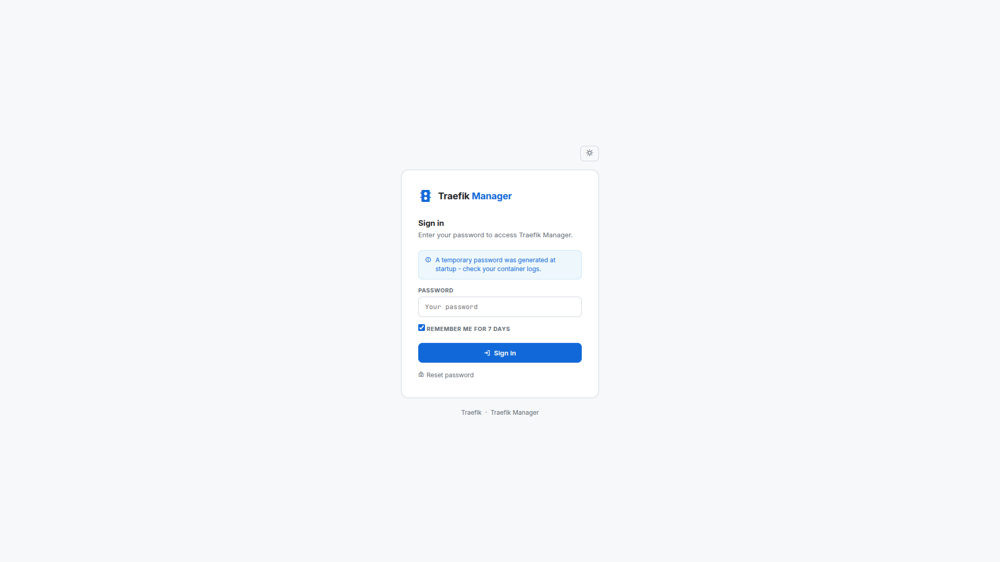
</picture></a>
<br /><b>1. Temporary password</b>
</td>
<td width="33%">
<a href="docs/images/dark-setup-welcome-2.png" target="_blank"><picture>
  <source media="(prefers-color-scheme: dark)" srcset="docs/images/dark-setup-welcome-2.png">
  
</picture></a>
<br /><b>2. Welcome</b>
</td>
<td width="33%">
<a href="docs/images/dark-setup-conn-dom-3.png" target="_blank"><picture>
  <source media="(prefers-color-scheme: dark)" srcset="docs/images/dark-setup-conn-dom-3.png">
  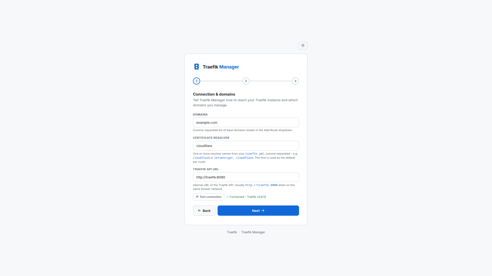
</picture></a>
<br /><b>3. Connection &amp; domains</b>
</td>
</tr>
<tr>
<td>
<a href="docs/images/dark-setup-opt-tabs-4.png" target="_blank"><picture>
  <source media="(prefers-color-scheme: dark)" srcset="docs/images/dark-setup-opt-tabs-4.png">
  
</picture></a>
<br /><b>4. Optional tabs</b>
</td>
<td>
<a href="docs/images/dark-setup-set-pass-5.png" target="_blank"><picture>
  <source media="(prefers-color-scheme: dark)" srcset="docs/images/dark-setup-set-pass-5.png">
  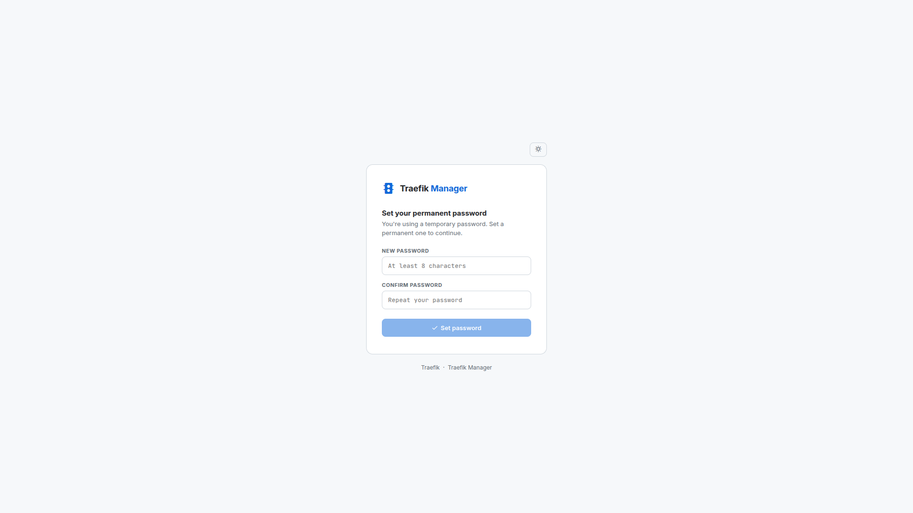
</picture></a>
<br /><b>5. Set password</b>
</td>
<td></td>
</tr>
</table>
</details>

<details>
<summary><b>Dashboard</b></summary>
<p align="center">
<a href="docs/images/dark-dashboard.png" target="_blank"><picture>
  <source media="(prefers-color-scheme: dark)" srcset="docs/images/dark-dashboard.png">
  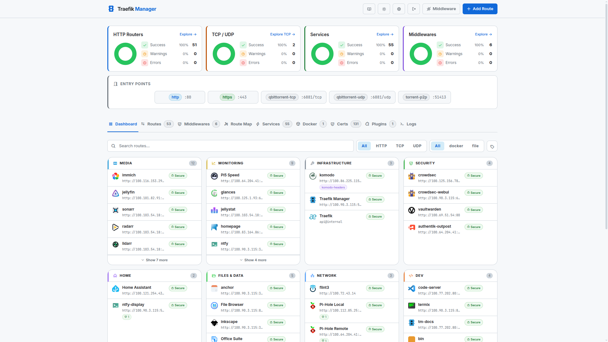
</picture></a>
<a href="docs/images/dark-dashboard-compact.png" target="_blank"><picture>
  <source media="(prefers-color-scheme: dark)" srcset="docs/images/dark-dashboard-compact.png">
  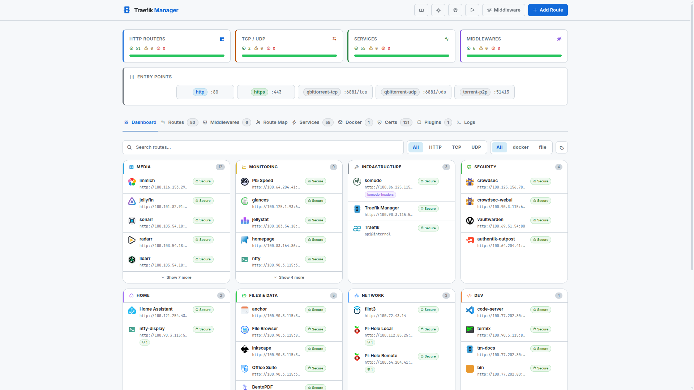
</picture></a>
</p>
<p align="center">
<a href="docs/images/dark-dashboard-no-widgets.png" target="_blank"><picture>
  <source media="(prefers-color-scheme: dark)" srcset="docs/images/dark-dashboard-no-widgets.png">
  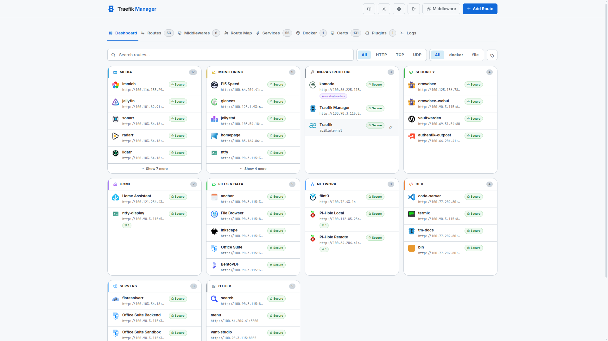
</picture></a>
<a href="docs/images/dark-dashboard-edit-group.png" target="_blank"><picture>
  <source media="(prefers-color-scheme: dark)" srcset="docs/images/dark-dashboard-edit-group.png">
  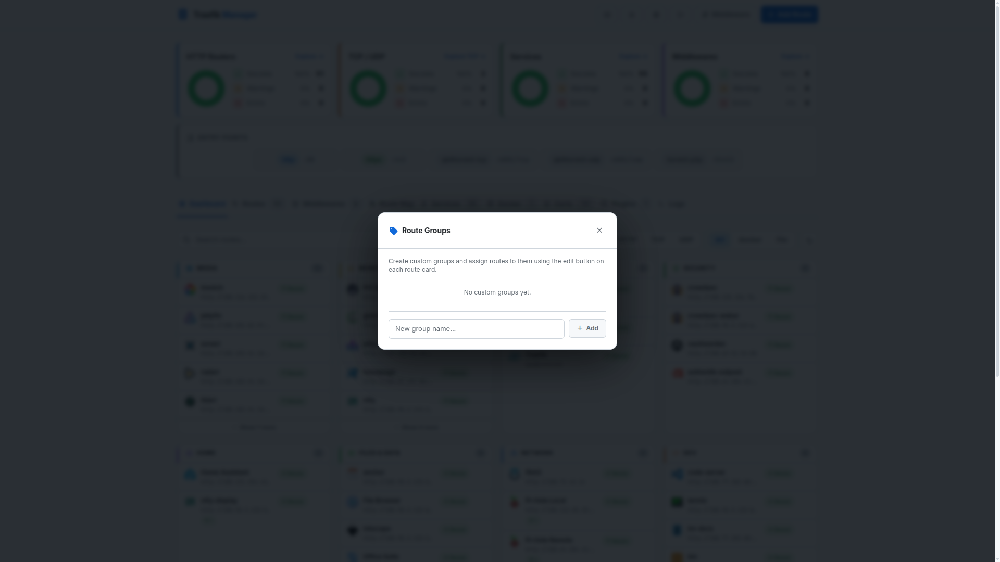
</picture></a>
<a href="docs/images/dark-dashboard-edit-route.png" target="_blank"><picture>
  <source media="(prefers-color-scheme: dark)" srcset="docs/images/dark-dashboard-edit-route.png">
  
</picture></a>
</p>
</details>

<details>
<summary><b>Routes</b></summary>
<table>
<tr>
<td width="33%">
<a href="docs/images/dark-routes.png" target="_blank"><picture>
  <source media="(prefers-color-scheme: dark)" srcset="docs/images/dark-routes.png">
  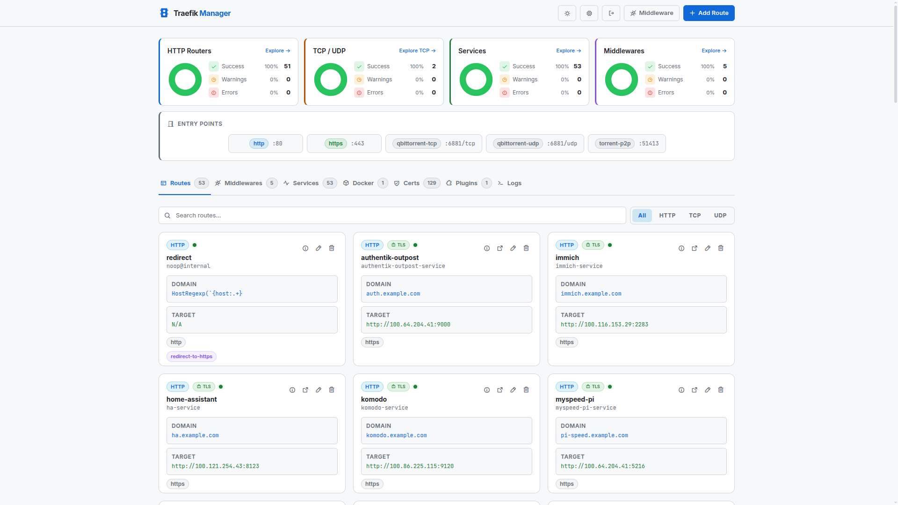
</picture></a>
<br /><b>Overview</b>
</td>
<td width="33%">
<a href="docs/images/dark-route-details.png" target="_blank"><picture>
  <source media="(prefers-color-scheme: dark)" srcset="docs/images/dark-route-details.png">
  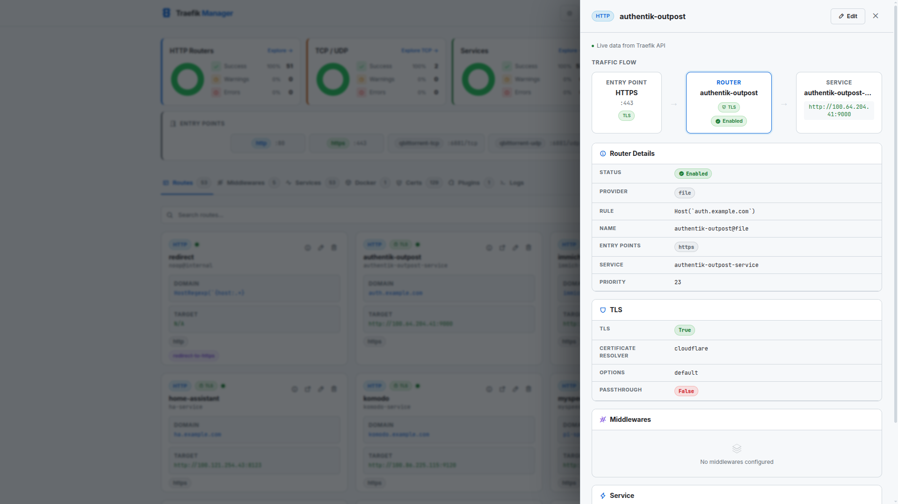
</picture></a>
<br /><b>Details</b>
</td>
<td width="33%">
<a href="docs/images/dark-route-edit.png" target="_blank"><picture>
  <source media="(prefers-color-scheme: dark)" srcset="docs/images/dark-route-edit.png">
  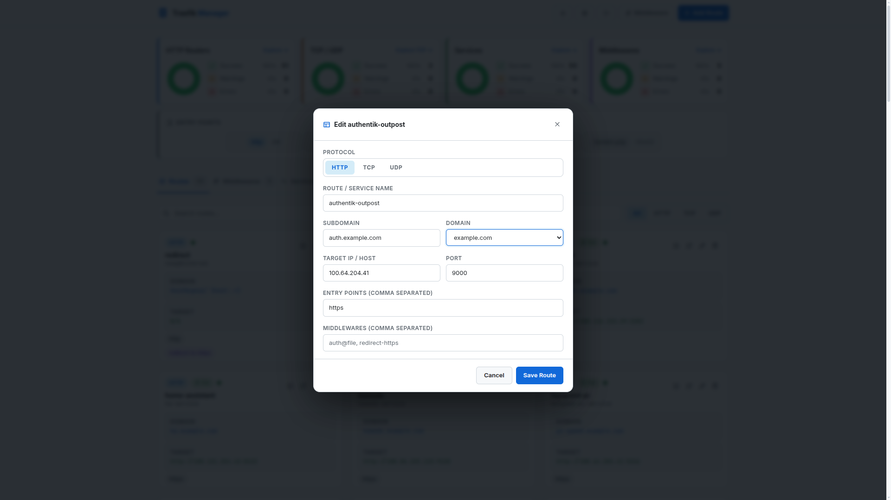
</picture></a>
<br /><b>Edit</b>
</td>
</tr>
<tr>
<td>
<a href="docs/images/dark-route-add-http.png" target="_blank"><picture>
  <source media="(prefers-color-scheme: dark)" srcset="docs/images/dark-route-add-http.png">
  
</picture></a>
<br /><b>Add HTTP</b>
</td>
<td>
<a href="docs/images/dark-route-add-tcp.png" target="_blank"><picture>
  <source media="(prefers-color-scheme: dark)" srcset="docs/images/dark-route-add-tcp.png">
  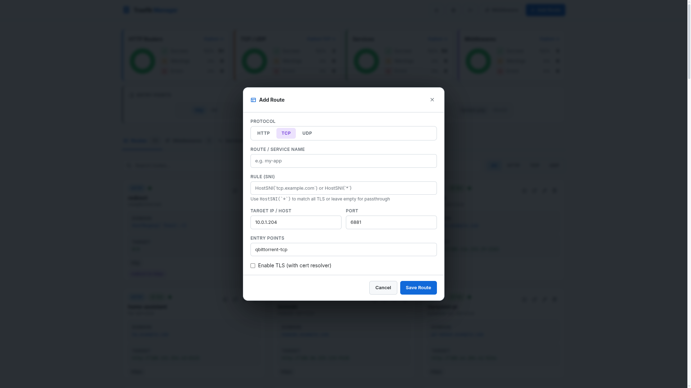
</picture></a>
<br /><b>Add TCP</b>
</td>
<td>
<a href="docs/images/dark-route-add-udp.png" target="_blank"><picture>
  <source media="(prefers-color-scheme: dark)" srcset="docs/images/dark-route-add-udp.png">
  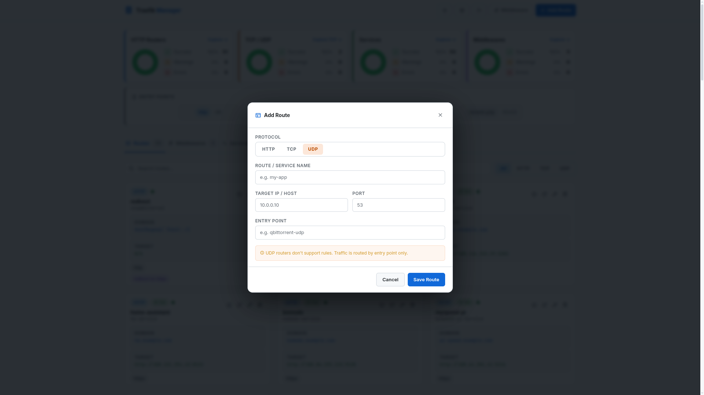
</picture></a>
<br /><b>Add UDP</b>
</td>
</tr>
</table>
</details>

<details>
<summary><b>Services</b></summary>
<p align="center">
<a href="docs/images/dark-services.png" target="_blank"><picture>
  <source media="(prefers-color-scheme: dark)" srcset="docs/images/dark-services.png">
  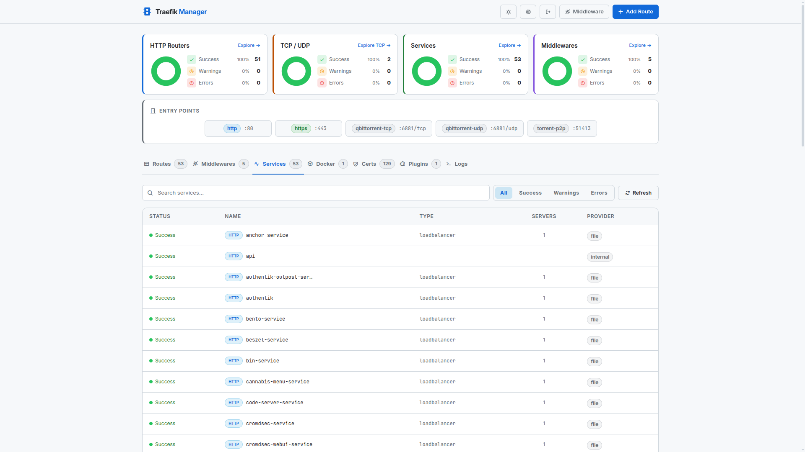
</picture></a>
<a href="docs/images/dark-services-details.png" target="_blank"><picture>
  <source media="(prefers-color-scheme: dark)" srcset="docs/images/dark-services-details.png">
  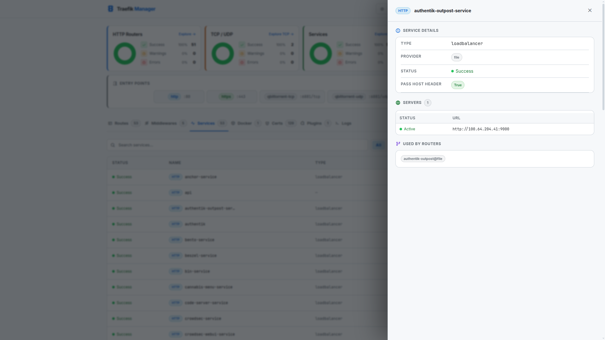
</picture></a>
</p>
</details>

<details>
<summary><b>Middlewares</b></summary>
<table>
<tr>
<td>
<a href="docs/images/dark-middleware.png" target="_blank"><picture>
  <source media="(prefers-color-scheme: dark)" srcset="docs/images/dark-middleware.png">
  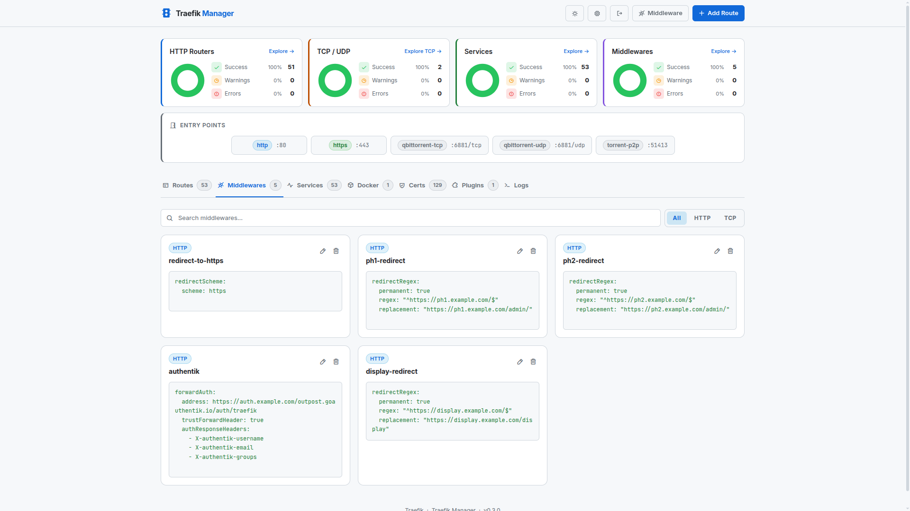
</picture></a>
<br /><b>List</b>
</td>
<td>
<a href="docs/images/dark-middleware-edit.png" target="_blank"><picture>
  <source media="(prefers-color-scheme: dark)" srcset="docs/images/dark-middleware-edit.png">
  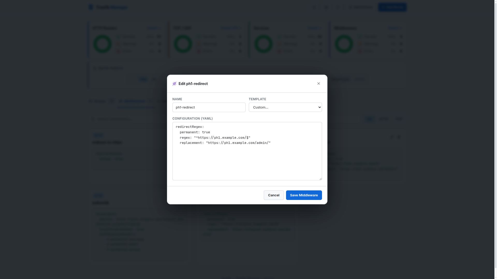
</picture></a>
<br /><b>Edit</b>
</td>
<td>
<a href="docs/images/dark-middleware-add.png" target="_blank"><picture>
  <source media="(prefers-color-scheme: dark)" srcset="docs/images/dark-middleware-add.png">
  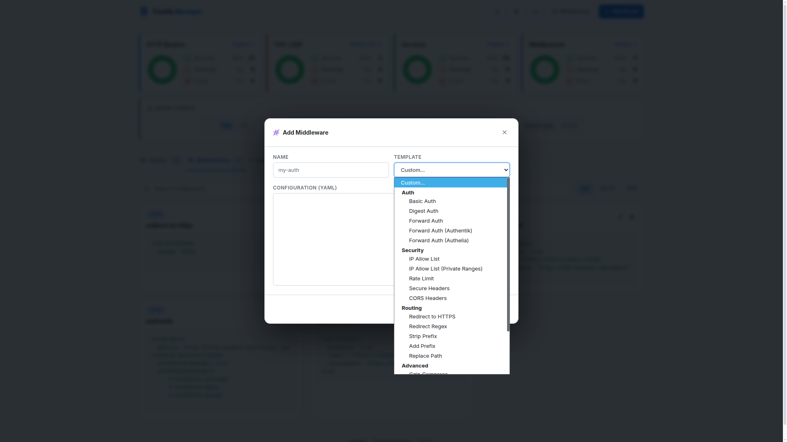
</picture></a>
<br /><b>Add</b>
</td>
</tr>
</table>
</details>

<details>
<summary><b>Plugins & Certificates</b></summary>
<p align="center">
<a href="docs/images/dark-plugins.png" target="_blank"><picture>
  <source media="(prefers-color-scheme: dark)" srcset="docs/images/dark-plugins.png">
  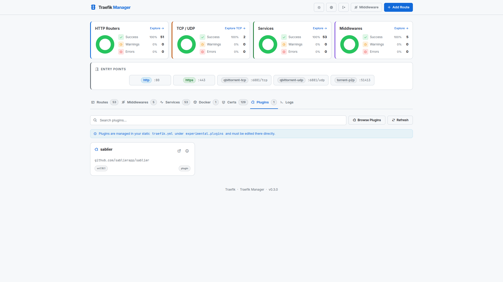
</picture></a>
<a href="docs/images/dark-plugins-details.png" target="_blank"><picture>
  <source media="(prefers-color-scheme: dark)" srcset="docs/images/dark-plugins-details.png">
  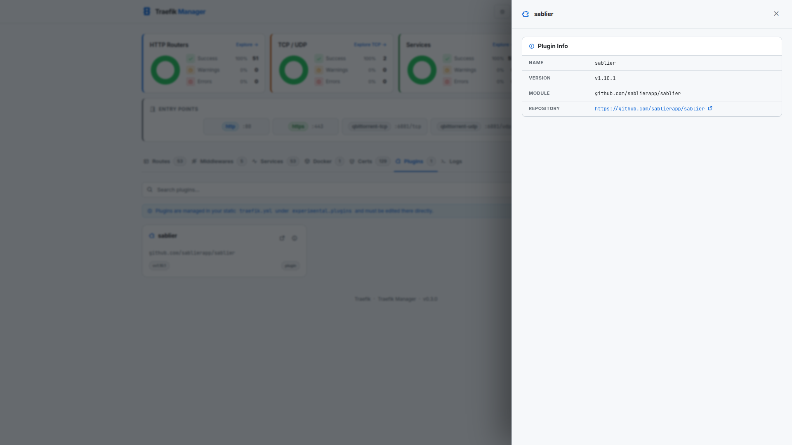
</picture></a>
<a href="docs/images/dark-certs.png" target="_blank"><picture>
  <source media="(prefers-color-scheme: dark)" srcset="docs/images/dark-certs.png">
  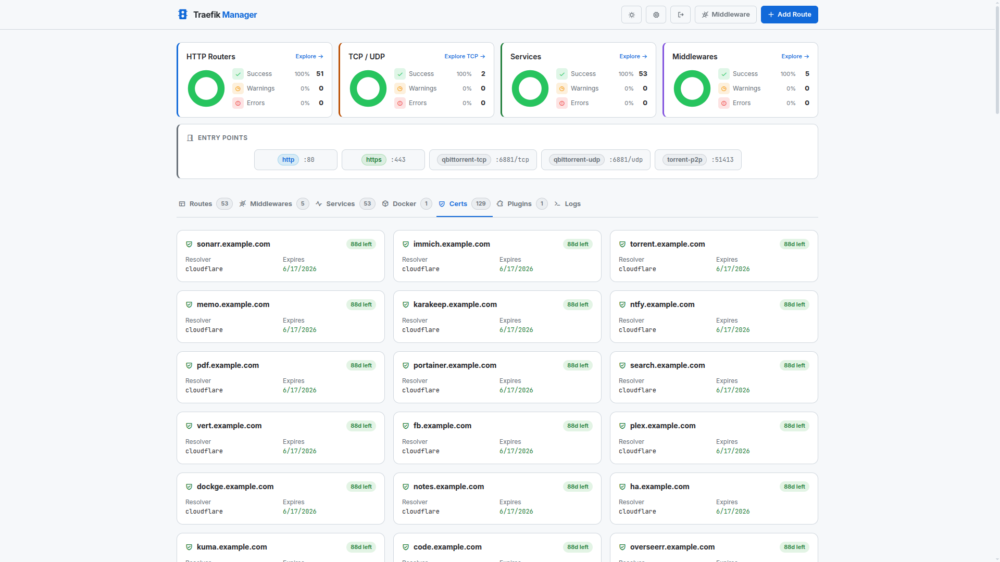
</picture></a>
</p>
</details>

<details>
<summary><b>Docker Provider</b></summary>
<p align="center">
<a href="docs/images/dark-docker.png" target="_blank"><picture>
  <source media="(prefers-color-scheme: dark)" srcset="docs/images/dark-docker.png">
  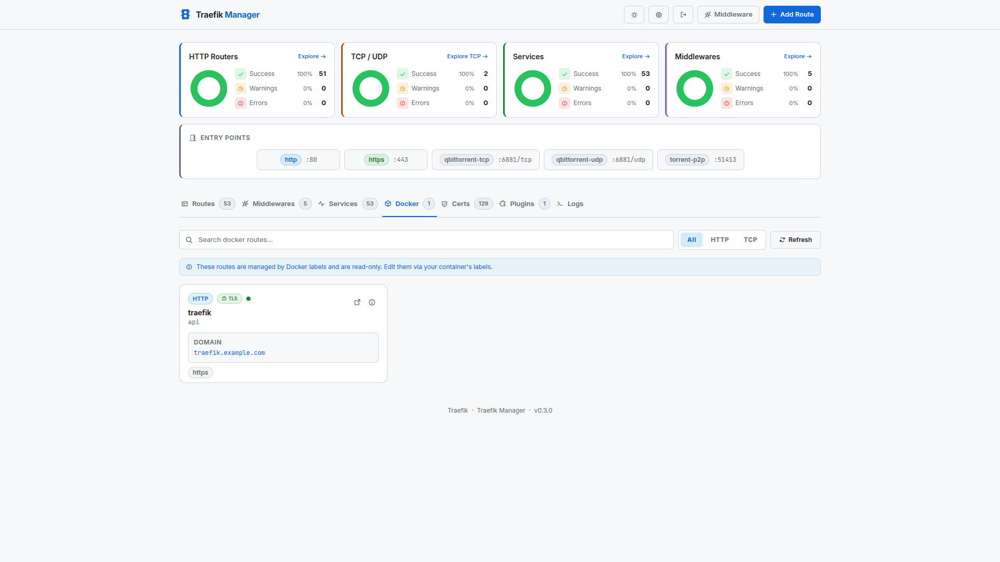
</picture></a>
<a href="docs/images/dark-docker-details.png" target="_blank"><picture>
  <source media="(prefers-color-scheme: dark)" srcset="docs/images/dark-docker-details.png">
  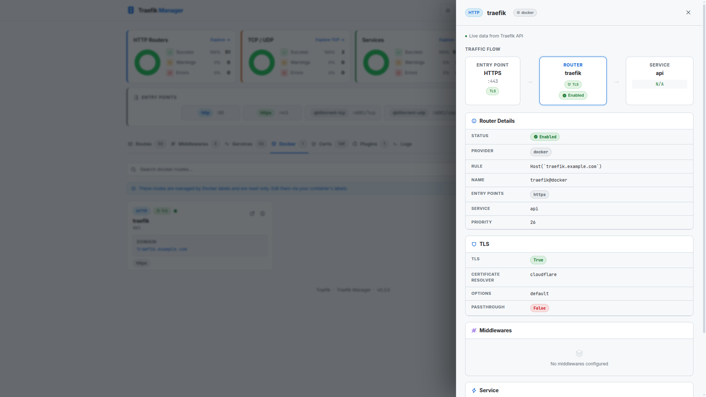
</picture></a>
</p>
</details>

<details>
<summary><b>Route Map</b></summary>
<p align="center">
<a href="docs/images/dark-route-map.png" target="_blank"><picture>
  <source media="(prefers-color-scheme: dark)" srcset="docs/images/dark-route-map.png">
  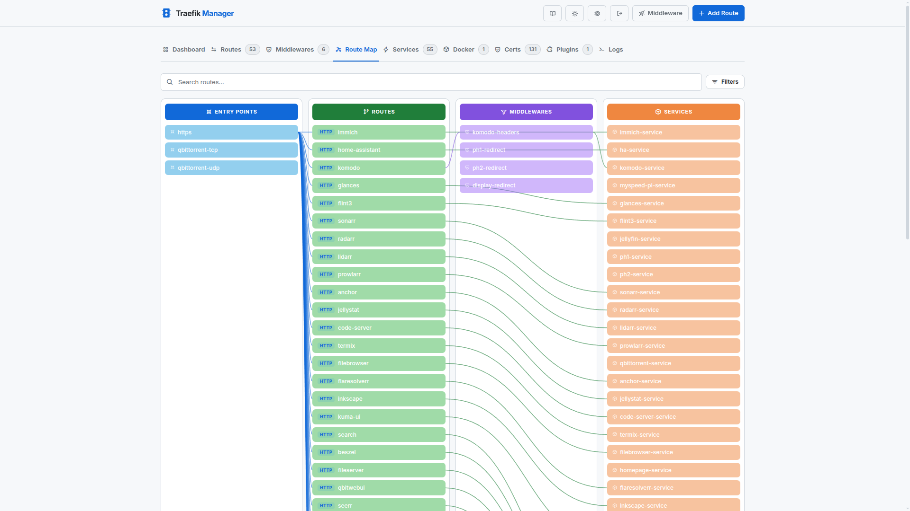
</picture></a>
<a href="docs/images/dark-route-map-hover.png" target="_blank"><picture>
  <source media="(prefers-color-scheme: dark)" srcset="docs/images/dark-route-map-hover.png">
  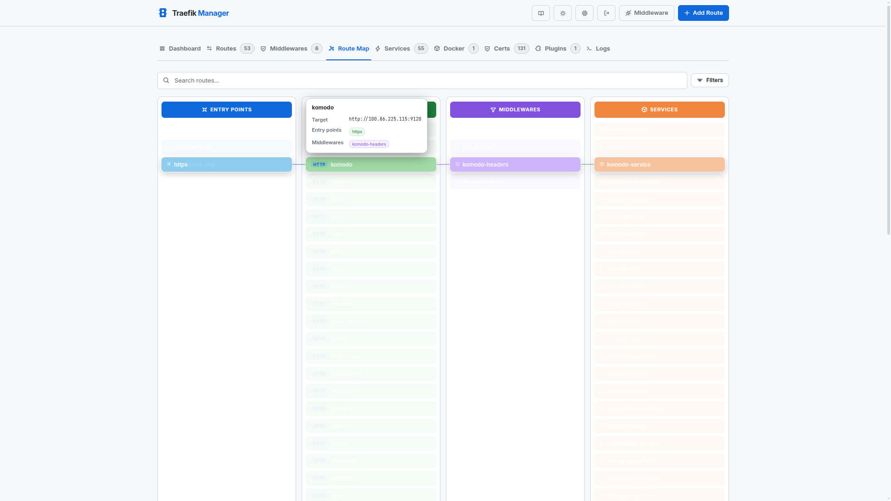
</picture></a>
</p>
</details>

<details>
<summary><b>Logs</b></summary>
<p align="center">
<a href="docs/images/dark-logs.png" target="_blank"><picture>
  <source media="(prefers-color-scheme: dark)" srcset="docs/images/dark-logs.png">
  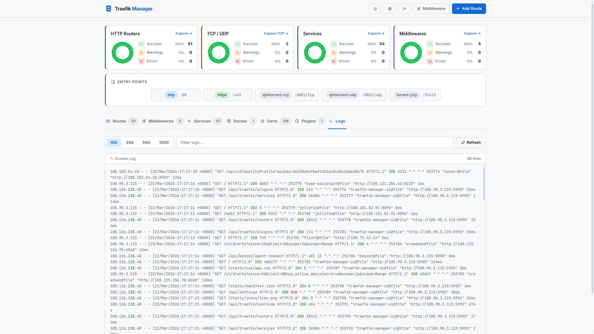
</picture></a>
</p>
</details>

<details>
<summary><b>Settings</b></summary>
<table>
<tr>
<td width="33%">
<a href="docs/images/dark-settins-auth.png" target="_blank"><picture>
  <source media="(prefers-color-scheme: dark)" srcset="docs/images/dark-settins-auth.png">
  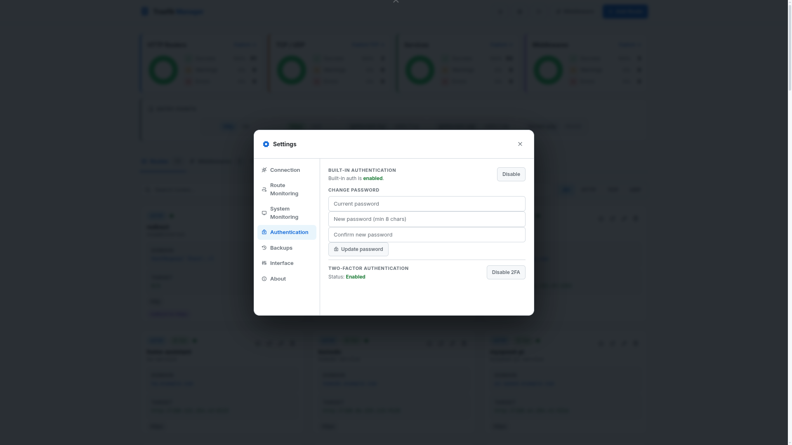
</picture></a>
<br /><b>Authentication</b>
</td>
<td width="33%">
<a href="docs/images/dark-settins-connections.png" target="_blank"><picture>
  <source media="(prefers-color-scheme: dark)" srcset="docs/images/dark-settins-connections.png">
  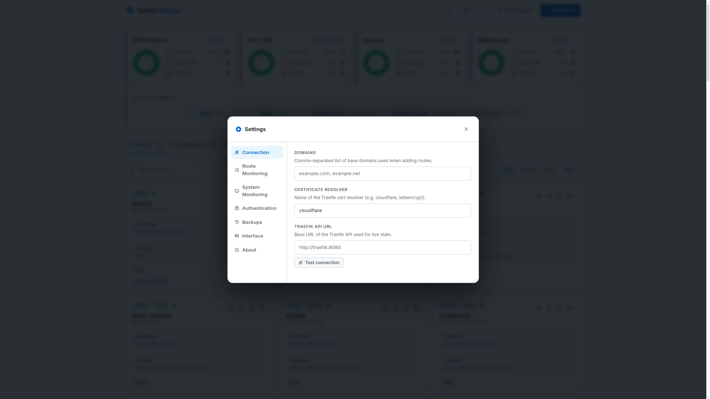
</picture></a>
<br /><b>Connections</b>
</td>
<td width="33%">
<a href="docs/images/dark-settins-routes.png" target="_blank"><picture>
  <source media="(prefers-color-scheme: dark)" srcset="docs/images/dark-settins-routes.png">
  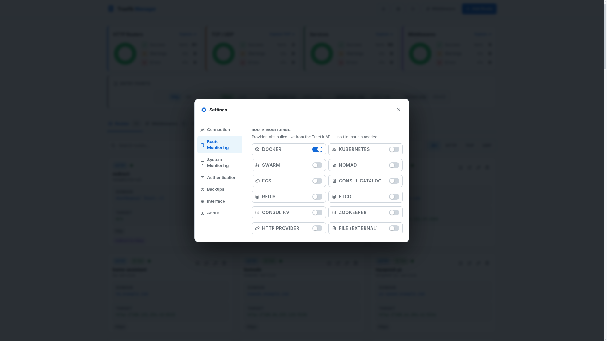
</picture></a>
<br /><b>Routes Config</b>
</td>
</tr>
<tr>
<td>
<a href="docs/images/dark-settins-system.png" target="_blank"><picture>
  <source media="(prefers-color-scheme: dark)" srcset="docs/images/dark-settins-system.png">
  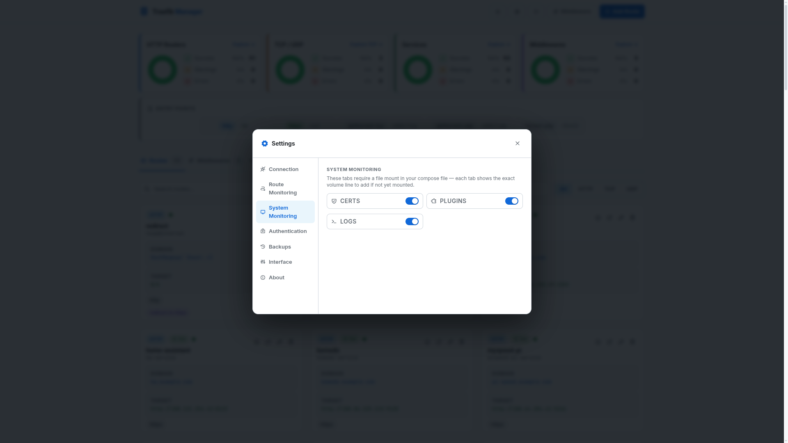
</picture></a>
<br /><b>System</b>
</td>
<td>
<a href="docs/images/dark-settins-backups.png" target="_blank"><picture>
  <source media="(prefers-color-scheme: dark)" srcset="docs/images/dark-settins-backups.png">
  
</picture></a>
<br /><b>Backups</b>
</td>
<td>
<a href="docs/images/dark-settins-ui.png" target="_blank"><picture>
  <source media="(prefers-color-scheme: dark)" srcset="docs/images/dark-settins-ui.png">
  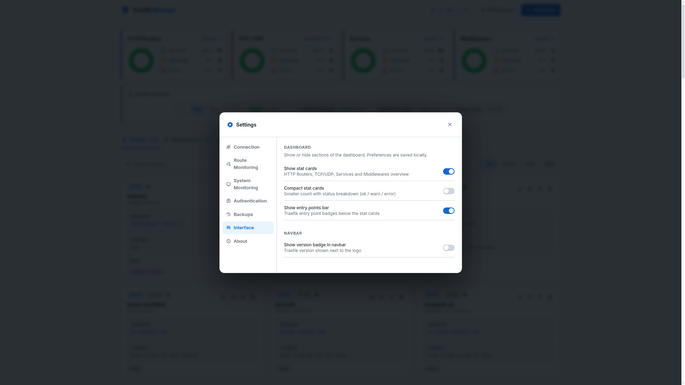
</picture></a>
<br /><b>UI Preferences</b>
</td>
</tr>
</table>
</details>

---

## Features

**Routing & Middleware**
- Add, edit, delete, and **enable/disable** HTTP, TCP, and UDP routes - no YAML editing required
- Create middlewares with built-in templates (Basic Auth, Forward Auth, Redirect, Strip Prefix)
- **Multi-config file support** - mount several dynamic config files with `CONFIG_DIR` or `CONFIG_PATHS`; a dropdown selects which file each route or middleware is saved to; **create new files on the fly** when `CONFIG_DIR` is set
- Timestamped backups before every change; one-click restore from Settings

**Live Dashboard**
- Real-time stats: router counts, service health, entrypoints, Traefik version
- Provider tabs: Docker, Kubernetes, Swarm, Nomad, ECS, Consul Catalog, Redis, etcd, Consul KV, ZooKeeper, HTTP Provider, File - all API-based, no extra mounts
- **Filter live services** by protocol (HTTP/TCP/UDP) and provider (docker, file, kubernetes…)
- **List view toggle** on Routes, Middlewares, and Services tabs - switch between card grid and compact table

**Visualizations** *(optional, toggle in Settings)*
- **Dashboard tab** - routes grouped by category (Media, Monitoring, Infrastructure, etc.) with app icons sourced from [selfh.st/icons](https://selfh.st/icons/), cached locally, and per-card editing (display name, icon override, group override)
- **Route Map tab** - 4-column topology view (Entry Points - Routes - Middlewares - Services) with Bezier curve connections, hover-to-highlight, and route tooltips

**System Monitoring** *(optional file mounts)*
- **Certs** - `acme.json` certificates with expiry tracking
- **Plugins** - plugins from your static `traefik.yml`
- **Logs** - live Traefik access log tail

**Security**
- bcrypt passwords (cost 12), CSRF protection, session management with session fixation protection
- Optional TOTP 2FA · 7-day remember me · configurable inactivity timeout
- Auto-generated password on first start · CLI recovery with `flask reset-password`
- **Per-device API keys** - up to 10 named keys (e.g. "My Phone"), each independently revocable via `X-Api-Key` header
- **Rate limiting** on login and auth endpoints (Flask-Limiter)
- **Atomic config writes** - crash-safe YAML saves via temp file + rename
- **Encrypted OTP secret** - TOTP seed encrypted at rest with Fernet


---

## Mobile App

**traefik-manager-mobile** is a React Native companion app for managing Traefik Manager from your phone. Requires **Traefik Manager v0.6.0 or higher**.

|          |                                                                                                |
| ----------| ------------------------------------------------------------------------------------------------|
| Repo     | [github.com/chr0nzz/traefik-manager-mobile](https://github.com/chr0nzz/traefik-manager-mobile) |
| Download | [Latest release](https://github.com/chr0nzz/traefik-manager-mobile/releases/latest)            |
| Auth     | Per-device API key - generate one in **Settings → Authentication → App / Mobile API Keys**     |

Features: browse routes, middlewares, and services · enable/disable routes · add and edit routes and middlewares (12 middleware templates) · backend scheme + pass host header controls · multi-config file picker · edit mode for bulk actions · system light/dark theme.

---

## Quick Start

```yaml
services:
  traefik-manager:
    image: ghcr.io/chr0nzz/traefik-manager:latest
    container_name: traefik-manager
    restart: unless-stopped
    ports:
      - "5000:5000"
    environment:
      - COOKIE_SECURE=false
    volumes:
      - /path/to/traefik/dynamic.yml:/app/config/dynamic.yml
      - /path/to/traefik-manager/config:/app/config
      - /path/to/traefik-manager/backups:/app/backups
```

```bash
docker compose up -d
```

Open **http://your-server:5000** - the setup wizard will guide you through the rest.

---

## Deployment

| Runtime　 | Guide                                                                                          |
| -----------| ------------------------------------------------------------------------------------------------|
| 🐳 Docker | [Docker Compose setup, networking, behind Traefik](https://traefik-manager.xyzlab.dev/docker/) |
| 🦭 Podman | [Rootless, Quadlet/systemd, SELinux labels](https://traefik-manager.xyzlab.dev/podman/)        |
| 🐧 Linux　| [Native Python + systemd, no container required](https://traefik-manager.xyzlab.dev/linux/)    |

---

## Documentation

Full documentation at **[traefik-manager.xyzlab.dev](https://traefik-manager.xyzlab.dev/)**

| | |
|---|---|
| [Get Started](https://traefik-manager.xyzlab.dev/docker/) | Deployment guides for Docker, Podman, and Linux |
| [Configuration](https://traefik-manager.xyzlab.dev/manager-yml/) | `manager.yml` reference |
| [Environment Variables](https://traefik-manager.xyzlab.dev/env-vars/) | `CONFIG_DIR`, `CONFIG_PATHS`, auth, domains, and more |
| [Security](https://traefik-manager.xyzlab.dev/security/) | API keys, sessions, CSRF, rate limits, and hardening |
| [API Reference](https://traefik-manager.xyzlab.dev/api/) | REST API for integrations and the mobile app |
| [Mobile App](https://traefik-manager.xyzlab.dev/mobile/) | Android companion app setup and features |
| [Reset Password](https://traefik-manager.xyzlab.dev/reset-password/) | CLI reset, TOTP recovery, manual reset |
| [UI Examples](https://traefik-manager.xyzlab.dev/ui-examples/) | Screenshots and walkthroughs |
| [Provider Tabs](https://traefik-manager.xyzlab.dev/) | Docker, Kubernetes, Swarm, Nomad, ECS, and more |

---

## Tech Stack

| Layer     | Technology                                    |
| -----------| -----------------------------------------------|
| Backend   | Python 3.11 · Flask · Gunicorn                |
| Config    | ruamel.yaml (preserves comments)              |
| Auth      | bcrypt · pyotp (TOTP) · Flask sessions · CSRF · Flask-Limiter · Fernet |
| Frontend  | Vanilla JS · Tailwind CSS · Phosphor Icons    |
| Container | Docker · Alpine Linux                         |

---

## Contributing

Pull requests are welcome. For larger changes please open an issue first.

## Star History

<a href="https://www.star-history.com/?repos=chr0nzz%2Ftraefik-manager&type=date&legend=top-left">
 <picture>
   <source media="(prefers-color-scheme: dark)" srcset="https://api.star-history.com/image?repos=chr0nzz/traefik-manager&type=date&theme=dark&legend=top-left" />
   <source media="(prefers-color-scheme: light)" srcset="https://api.star-history.com/image?repos=chr0nzz/traefik-manager&type=date&legend=top-left" />
   
 </picture>
</a>

## License

[GPL-3.0](LICENSE)
